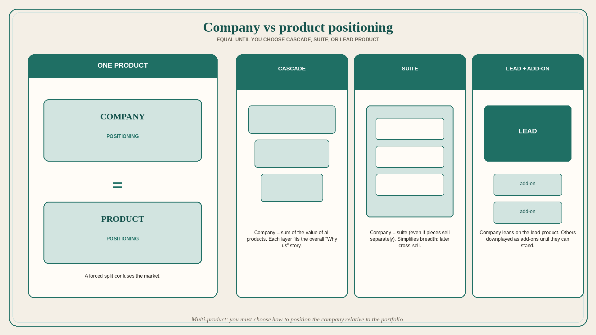

# Company positioning equals product positioning — until you choose cascade, suite, or lead product

**Source:** April Dunford (@aprildunford)
**Post:** https://x.com/aprildunford/status/1587832771761901568

## What it claims

If the company has only one product, how does company positioning differ from product positioning — and what happens with many products? In single-product companies, company positioning equals product positioning. Forcing a separation is expensive and potentially confusing to the market (many never understood Research in Motion vs Blackberry, and it did not matter). When you launch a second product you can stretch company positioning to accommodate it; there are many great single-product companies where company = product (pre-Salesforce Slack, Canva, Twilio). With multiple products you have choices. In large companies positioning is often cascading: the company is positioned as delivering the sum of the value of all the products. At IBM the company was the only provider of HW, SW, and Services; Software Group was the leader in middleware; Database sat under that; each product’s positioning fit the overall “Why IBM” story. Another pattern is the suite: like a single-product company, company positioning becomes equal to suite positioning (even if products can be bought separately); Docebo is an example. Pulling everything into a suite or solution simplifies positioning and makes the full breadth clear; even if customers start by buying a piece, it helps the case for later cross-sell. Sometimes products are not equal as a starting point: one “base” product customers adopt first, others positioned as add-ons to cross-sell and upsell later. Then company positioning leans heavily on the lead product; others are downplayed. Salesforce, until recently, positioned mainly as a sales CRM — marketed the CRM first, cross-sold the rest later — which made sense when they did not have the leading marketing suite but could claim the best marketing suite for folks using their CRM. Today, with Slack, Tableau, and others in the mix, Salesforce is attempting to position Customer 360 (the whole portfolio) as “real-time CRM,” a mega-suite; Dunford finds this confusing and expects it to evolve. So: one product — unnecessary and potentially dangerous to position the company as something different. Multiple products — you must choose how to position the company relative to the products in the portfolio.

## Why it matters for a PO

A single-product train that invents a separate “company narrative” splits the story buyers hear. A portfolio PO must pick cascade vs suite vs lead-product — or the backlog will clone every sibling product’s features instead of fitting a “Why us” story. Salesforce-style mega-suite language that confuses even a positioning expert is a warning, not a template.

## 3 takeaways

1. One product: company = product; a forced split confuses the market.
2. Multi-product: choose cascade (sum of value), suite (company = suite), or lead-product + add-ons.
3. Lead-product positioning downplays the rest on purpose; a mega-suite re-position can confuse.

## Practice this week

Write one sentence: are we single-product, cascade, suite, or lead+add-on? Check the current epic list against that sentence. Cut or retag one item that only exists because company positioning was allowed to drift from the product story.
