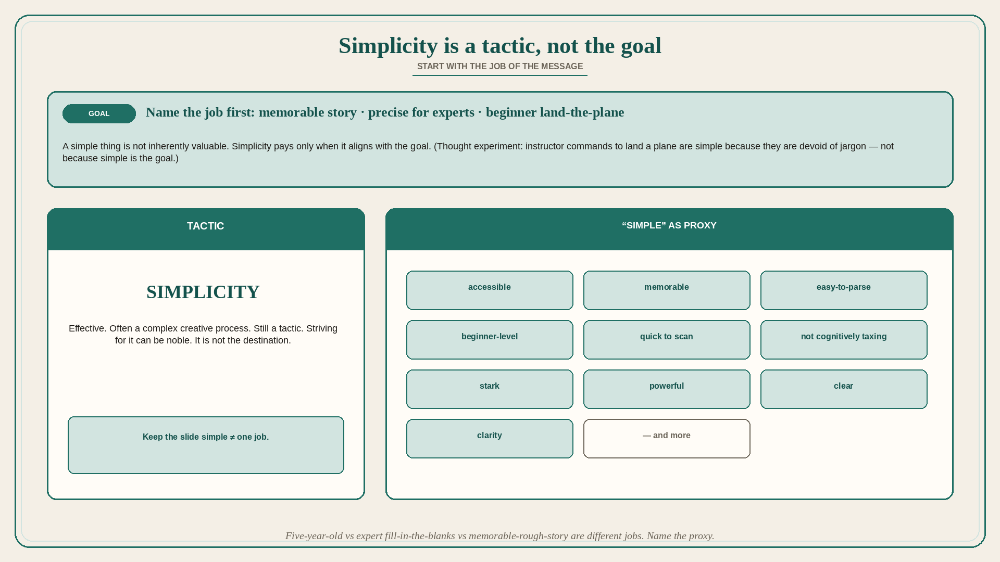

# Simplicity is a tactic, not the goal

**Source:** John Cutler (@johncutlefish)
**Post:** https://x.com/johncutlefish/status/1578166438266748931

## What it claims

Simplicity is a tactic, not the goal. A simple thing is not inherently valuable; simplicity is valuable if it aligns with your goals. Thought experiment: the pilot of a plane dies suddenly; a passenger attempts to land with a flight instructor. Do the instructor’s commands sound simple? Yes. But they are more than simple: devoid of jargon, acronyms, and standard ATC protocol, they help the non-pilot land safely. If you have usability-tested content, you have learned this firsthand. Some content tests amazingly internally — the team loves it — and falls completely flat with external users. Or it lands for users who need the tl;dr and a spark of inspiration and falls flat for people who want more precision. The same holds for internal communications. Sometimes the job of the message is to tell a memorable story everyone in the company can remember (even if the details are rough). When that goal is not clear, it confuses more experienced folks: “Was that intentionally vague? Or is that what they really think?” “Are they just figuring I’ll fill in the blanks myself?” “Am I the actual audience here?” The confusion is warranted. “Simple” can be a proxy for: accessible, memorable, easy-to-parse, beginner-level, quick to scan, not cognitively taxing, stark, powerful, clear, clarity — and more. That is a huge range. “Keep the slide simple” could mean “something a five-year-old could understand” all the way to “ultimate, timeless clarity.” Put simply, simplicity is a tactic, not the goal. It can be a very effective tactic, and striving for it — often a complex creative process — can be noble. But it is still a tactic. Start with the goal.

## Why it matters for a PO

“Keep it simple” in refinement, PI readouts, and exec decks is an unstated job: five-year-old vs expert fill-in-the-blanks vs memorable-rough-story. Experienced people then wonder if they are even the audience. Name the job of the message before you cut the detail.

## 3 takeaways

1. Simple is not a value; it is a tactic that only pays when it matches the goal.
2. “Simple” proxies many jobs (accessible, memorable, beginner, scannable, stark, clear); they are not the same.
3. Internal content the team loves can still fail the real audience; start with the goal, then pick the simplicity tactic.

## Practice this week

Before the next readout, write the job of the message (memorable story / precise for experts / beginner land-the-plane). Circle which “simple” proxy you mean. If experts will be in the room and you chose beginner-level, add the missing precision or name them as not the audience.
