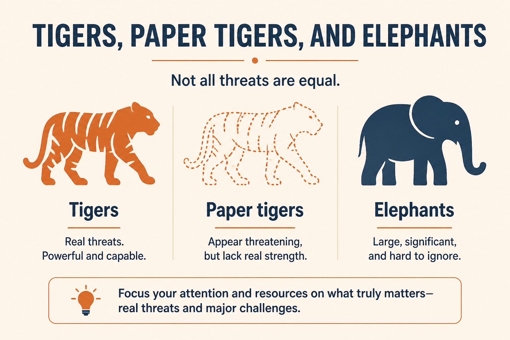

# Pre-mortems: Tigers, Paper Tigers, Elephants

**Source:** Shreyas Doshi (@shreyas)
**Post:** https://x.com/shreyas/status/1221257560033857536

## What it claims

A pre-mortem assumes the project has already failed and asks the team why — before launch. Standard sessions feel useful in the room and then evaporate. Shreyas’s script: silent writing of Tigers (real threats), Paper Tigers (scary but under control), and Elephants (the thing no one is talking about); +1s; discuss; then an action plan with a DRI on the deadliest few. The metaphors create psychological safety versus sounding like a naysayer.

## Why it matters for a PO

Launch risk lives in the PO’s inbox until it is named, owned, and sequenced. This is a Monday-applicable ritual that turns private worry into a DRI list without a blame culture.

## 3 takeaways

1. Assume failure first; don’t wait for the post-mortem.
2. Tigers vs Paper Tigers vs Elephants is the useful taxonomy.
3. No DRI + no tracking = theater.

## Practice this week

Run a 60-minute pre-mortem on one in-flight launch; publish a one-page action plan with DRIs for the top 3 Tigers.
