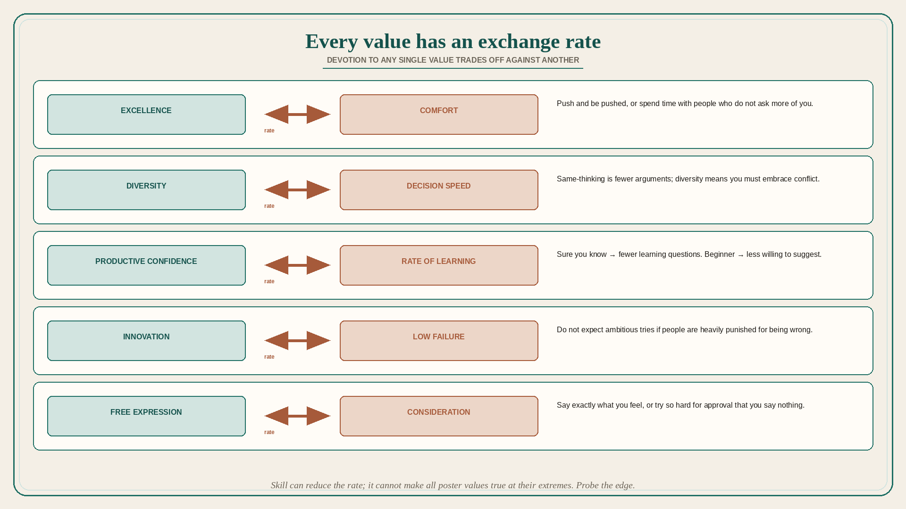

# Devotion to any single value has an exchange rate

**Source:** Julie Zhuo (@joulee)
**Post:** https://x.com/joulee/status/1600161902755123200

## What it claims

Devotion to any single value has a price and trades off against other values. To deeply understand a person or entity, seek to understand how they think about the exchange rate. Five examples: (1) Excellence trades off against comfort — if you want to be comfortable, spend time with people who do not ask more of you; if you want excellence, get ready to push and be pushed. (2) Diversity trades off against decision-making speed — if everyone thinks the same way there are fewer arguments so things move faster; if you believe in diversity you must embrace conflict and believe it leads to better outcomes. (3) Productive confidence trades off against rate of learning — the more you believe yourself knowledgeable, the less you ask questions with intent to learn; the more you consider yourself a beginner, the less you feel you should suggest your ideas. (4) Innovation trades off against low failure — do not expect anyone to try hard, ambitious things if they will be heavily punished for getting something wrong. (5) Free expression trades off against consideration for others — say exactly what you feel and others may be offended or even threatened; try too hard to win everyone’s approval and you will say nothing of substance. On a poster, all these values sound awesome: honest and transparent, considerate, innovative, driven to succeed, diverse, fast-moving, focused on excellence, positive and accepting. Beware: they cannot all exist with each other at their extremes. A more skillful company can reduce the exchange rate, but there is always some tradeoff they are accepting. It is your job to probe for that specific edge and ask for edge-case examples. Zhuo, as a student of team cultures, is obsessed with this and asks what dichotomies she missed.

## Why it matters for a PO

Trio and train posters list every virtue at once. Then “move faster” collides with “more voices,” “don’t fail” collides with “innovate,” and “be nice” collides with saying the backlog is wrong. A PO who can name the live exchange rate (and ask for an edge-case example) stops fake-agreeing to all extremes.

## 3 takeaways

1. Every value has a price in another value; the interesting fact is the exchange rate, not the poster.
2. Skill can reduce the rate; it cannot make all values true at their extremes.
3. Probe the edge and ask for examples — that is how you learn what the team will actually trade.

## Practice this week

Pick one current fight (speed vs diversity of views, innovation vs no-failure, excellence vs comfort). Write both values and the trade you are actually making. Ask one peer for an edge-case example of the last time they paid that price. Put the chosen side on the next trade-off, not both.
