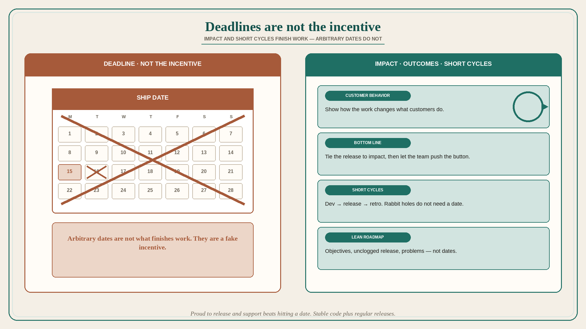

# Deadlines are not the incentive

**Source:** Janna Bastow (@simplybastow)
**Post:** https://x.com/simplybastow/status/1321105770570809344

## What it claims

People have a misconception that giving deadlines somehow incentivizes work to be done — as if having no deadlines means that nothing will ever get finished. Categorically untrue. People are incentivized to make an impact, so tie work to outcomes. Show the team how they can impact customer behavior and the bottom line by getting their work out the door. Let them push the button on releases and share the good news of what they are building with the world. The internal drive to make a difference is more powerful than the drive to meet arbitrary deadlines. So long as you have short development and release cycles, with opportunities for retros and learning, no one is going to get lost down a rabbit hole. ProdPad’s rubric (present in the unroll, not expanded beyond it): build this as if you are the one who is going to be training up a junior developer on how to use your code and docs in a couple of years’ time. Make something you are proud to release and support, even if it takes a little extra time. That might mean a couple more days in delivery to get the final output up to scratch, but the developers are as bought into the company goals as the next person, and take turns releasing — a mix of stable code and regular releases. If you are struggling with ditching deadlines, focus on: make sure you have got clear objectives; unclog your release process; move to a lean roadmap format that focuses the team on problems, not deadlines.

## Why it matters for a PO

Date-driven PI commitments train the trio to hit the date, not the outcome. A PO who ties work to customer behavior, short release cycles, and a problem-focused lean roadmap can drop the fake incentive without the backlog turning into a rabbit hole.

## 3 takeaways

1. Deadlines are not what finishes work; impact on customers and the bottom line is.
2. Short cycles plus retros keep people out of rabbit holes; arbitrary dates are not required for that.
3. Unclog release, name objectives, and roadmap problems — not dates.

## Practice this week

Pick one in-flight item whose only forcing function is a date. Rewrite the incentive as the customer behavior it should change, and name the next release/retro that will show whether it did. If the date is the only reason it is in the sprint, it is not ready.
