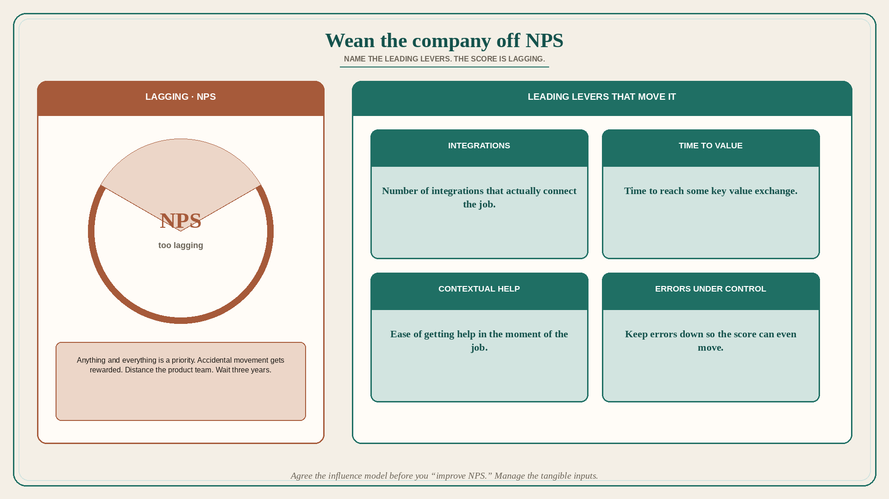

# Wean the company off NPS by naming the leading levers

**Source:** John Cutler (@johncutlefish)
**Post:** https://x.com/johncutlefish/status/1575718868659499010

## What it claims

A thought on how to wean your company off NPS: first you are going to need to lie a lot. You: “Oh NPS, how meaningful, yes…. I totally get it. I totally want to improve it.” Them: “Amazing.” You: “There’s one tiny issue… it is a lagging metric.” Them: “oh?” To improve it you will need to identify the levers that make it go up and down, and focus on those things. Show the current model for what influences NPS. Cutler’s example levers: number of integrations, time to reach some key value exchange, ease of getting contextual help, and keeping errors under control. It is really important to know what drives NPS — otherwise anything and everything is a priority. You would not want to reward a team for accidentally making NPS go up. So propose that you kind of distance the product team from NPS. It is too lagging. It is an amazing metric, and you see why they care — but these inputs are more tangible. Wait three years.

## Why it matters for a PO

A train scored on NPS will stuff the backlog with anything that might move a lagging survey. A PO who can name the actual levers (time-to-value, errors, help, integrations) can keep the exec love for NPS and still sequence work on inputs the trio can move.

## 3 takeaways

1. NPS is lagging; without named levers, everything is a priority and accidental movement gets rewarded.
2. Agree the influence model (integrations, time to key value exchange, contextual help, errors) before you “improve NPS.”
3. Distance the product team from the lagging score; manage the tangible inputs. This takes years, not a slide.

## Practice this week

If NPS (or a cousin CSAT) is on the PI dashboard, write four leading levers you actually believe move it. Pick one in-flight story and retag it to a lever — or drop it if it only exists to “help NPS.”
