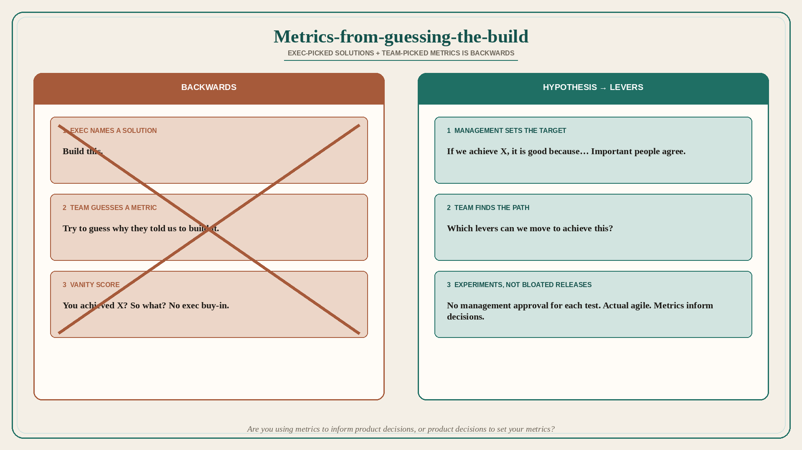

# Metrics-from-guessing-the-build is backwards

**Source:** Pavel A. Samsonov (@PavelASamsonov)
**Post:** https://x.com/PavelASamsonov/status/1594817299202154509

## What it claims

Most teams create metrics based on the logic of “try and guess why execs told us to build this.” Management picking solutions and teams selecting metrics is the exact backwards way to make a product. Management’s role is to set business targets; the team’s role is to find the best path to their target. Targets created bottom-up have no executive buy-in, so they are meaningless outside of vanity purposes. You achieved X? So what? It is management’s job to build the hypothesis “if we achieve X, it will be good because…” and ensure that the important people agree with that. With a stable hypothesis established, teams can test it — which levers can we move to achieve this? — without needing management-level approval for each experiment, or building bloated releases. In other words, actual agile development. The whole purpose of these metrics is to make better decisions. Ask yourself: are you using the metrics to inform product decisions, or using product decisions to set your metrics?

## Why it matters for a PO

After an exec names a feature, the trio invents a metric that will make the feature look successful. That is vanity. A PO who forces the hypothesis (“if we achieve X, it is good because…”) up to the people who matter can run experiments on levers instead of bloated releases that needed approval at every step.

## 3 takeaways

1. Exec-picked solutions + team-picked metrics is backwards; targets belong to management, paths to the team.
2. Bottom-up metrics without the “if we achieve X it is good because…” hypothesis are vanity.
3. A stable shared hypothesis is what makes experiments (and actual agile) possible; metrics exist to inform decisions, not to decorate a decision already made.

## Practice this week

For one committed item, write whether the metric was chosen to justify the build. Replace it with the management hypothesis sentence. If no important person will agree that sentence, the item is not a target — it is a solution in search of a score.
