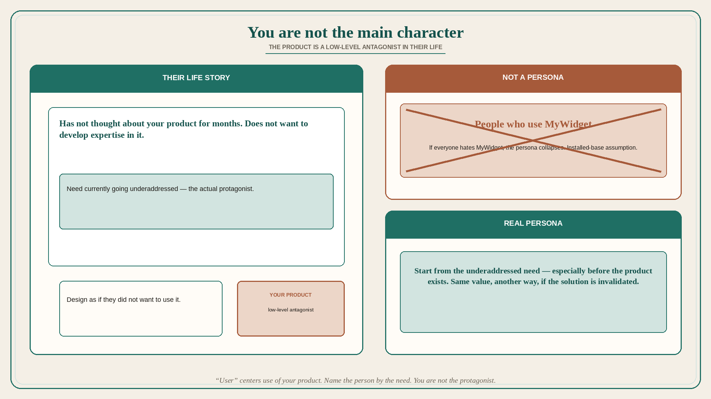

# You are not the main character in the user’s life

**Source:** Pavel A. Samsonov (@PavelASamsonov)
**Post:** https://x.com/PavelASamsonov/status/1569392626264117250

## What it claims

One fundamental mistake software design teams make is behaving like they are the main character in their user’s life story, and not the other way around. Design as if your user did not want to use your product or develop expertise, and has not thought about your product for months. With the exception of perhaps the iPhone’s UX team, the role your product plays in your customer’s life is a low-level antagonist. This is part of the reason Samsonov does not like to say “user” or “customer” outside of speaking broadly about design work as a whole — not because it is demeaning to call people users, but because “user” centers use of your product as the most important thing about that person. When working on a specific product team, it is far more fruitful to identify that persona beyond “people using my product,” because nobody is using your product right now: it does not exist. Start with the need that is currently going underaddressed, not that assumption. This also reduces the fallout from solution ideas being invalidated in testing. If the persona is “people who use MyWidget,” then discovering that everyone hates MyWidget is going to be bad news. A real persona means you can look for another way to deliver the same value.

## Why it matters for a PO

Backlog personas named “MyWidget user” collapse when the widget is hated — and they hide that most people have not thought about your product in months. A PO who starts from the underaddressed need can swap the solution without losing the person, and can retire stakeholder-favorite complexity that is not value.

## 3 takeaways

1. Design as if they do not want expertise in your product and have not thought about it for months; you are a low-level antagonist, not the protagonist.
2. “User” centers use of your product; name the person by the underaddressed need, especially before the product exists.
3. A MyWidget-user persona makes invalidation catastrophic; a real persona lets you deliver the same value another way.

## Practice this week

Rewrite one persona without the product name. If the remaining description is empty, you do not have a persona — you have an installed-base assumption. Add the underaddressed need, and mark one in-flight feature that only exists because internals like it.
