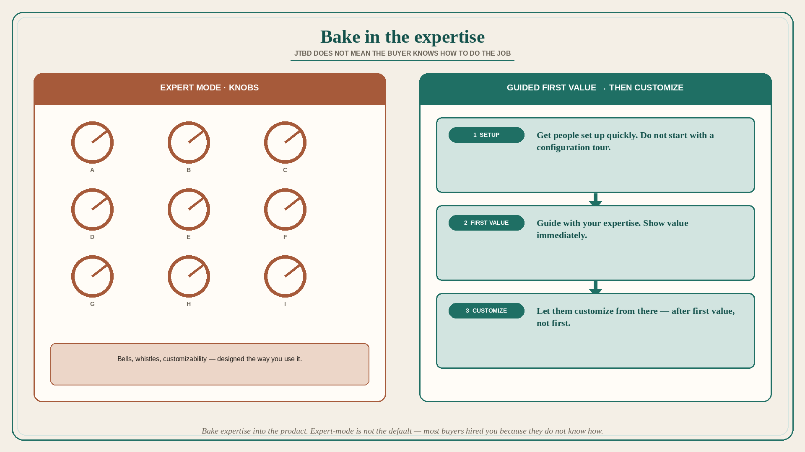

# Not everyone knows how to do the job; bake in the expertise

**Source:** Melissa Perri (@lissijean)
**Post:** https://x.com/lissijean/status/1595134299908771840

## What it claims

When building a product, remember not all of your users are experts in the domain — but that opens up a golden opportunity. It is important to gauge the level of competence in the domain with the users, especially if you are an expert in the area. People buy products because it fulfills a job-to-be-done, but that does not mean everyone knows how to do that job. So if you are designing it the way you want to use it — highly customizable and all the bells and whistles — this is probably at odds with a huge portion of your users looking for expert guidance and a quick start to getting value. You are designing for “expert mode,” and there is probably a portion of people who want that. But they are not in the product, exposed to it, as much as you are. When you bake your expertise into the product, instead of assuming the user is an expert, it becomes 100x valuable. Get people set up quickly, guide them with your expertise, and show them value immediately. Let them customize from there.

## Why it matters for a PO

Internal experts (and power users who live in the tool) pull the backlog toward knobs. Most buyers hired the product because they do not know how to do the job. A PO who sequences guided setup and immediate value before customization stops shipping expert-mode as the default.

## 3 takeaways

1. JTBD does not imply the buyer knows how to do the job; gauge competence, especially if you are the expert.
2. Bells, whistles, and customizability are expert-mode; most users want guidance and a quick start to value.
3. Bake expertise into setup and first value; customize after, not first.

## Practice this week

For one workflow, write who it was designed for: you / power user / first-week buyer. If it is you, add the guided path that gets a non-expert to first value without a configuration tour. Defer one customization story until that path exists.
