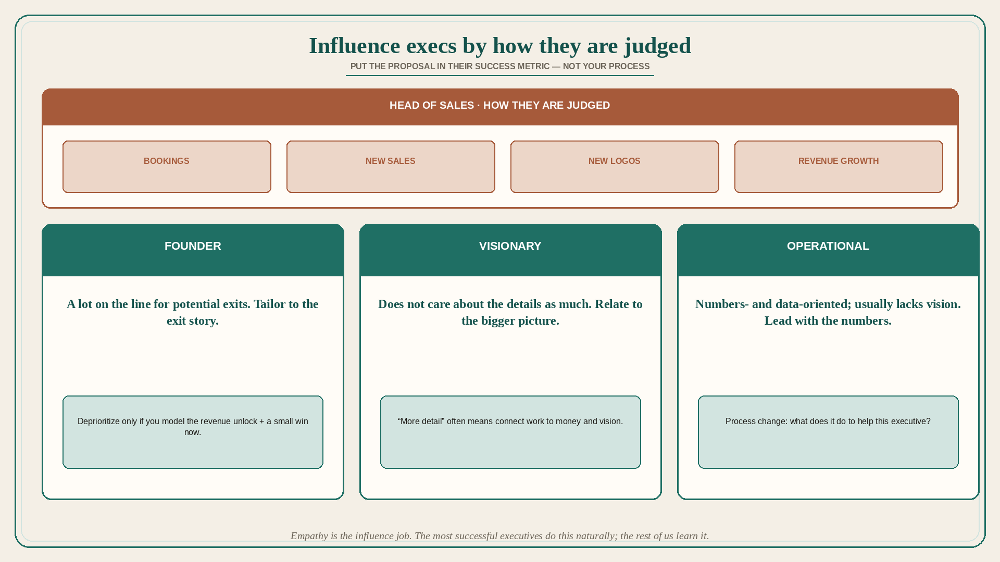

# Influence executives by how they are judged

**Source:** Melissa Perri (@lissijean)
**Post:** https://x.com/lissijean/status/1524900700949741568

## What it claims

A thread that keeps coming up: how do I convince my executives to change / do things I would like them to do as good product management. The thing people do most often that does not work is not taking the time to understand how other people are being judged for success and what matters to them. You have to learn to put your proposal in terms that will help the other person. Example: you have a problem with the Head of Sales. How are they judged for success? Bookings, new sales, new logos, revenue growth. Their comp is tied to it. How do you think they feel when you say you need to deprioritize something that they think will make money? You need to show them on the roadmap how making a choice to deprioritize one thing unlocks revenue from the things you are doing now. Model it out with them. In the case of tech debt, fewer features, building for the future — how can you get them some small wins now? Empathy is really important here, and listening to their concerns can surface tons of insights. What about the CEO? There are about three types of CEOs, some a combo, but rarely: Founder, Visionary, Operational. If you do not understand what type of CEO you have, you have probably been extremely frustrated in the past. Founders have a lot on the line when it comes to their potential exits. Visionaries do not care about the details as much — you need to relate your proposal to the bigger picture. Operationals are very numbers- and data-oriented, and usually lack vision. You need to be able to tailor your message for each of these backgrounds. CEOs who ask for extreme detail usually are not getting the level of detail they really want — how do we connect what we are doing to achieving money goals and vision? The same arguments apply to implementing process change, transformations, etc. What does it do to help the executive? How does it tie to their goals? It took Perri quite a while to learn this, and probably even longer to actually do it, but it is a game changer. The most successful executives do all this naturally. The rest of us have to learn it.

## Why it matters for a PO

“Please let us do discovery / pay down debt / drop that sales special” fails because it is phrased as a product preference. A PO who can model the sales-comp impact, offer a small win now, and retell the same proposal as exit / vision / numbers depending on the CEO type is doing the actual influence job.

## 3 takeaways

1. Influence starts with how the other person is judged (and paid), not with how good your process is.
2. Deprioritization needs a modeled unlock of current revenue plus a near-term win, especially vs Sales.
3. Tailor to Founder (exit), Visionary (bigger picture), Operational (numbers); “more detail” often means connect work to money and vision.

## Practice this week

Before the next exec ask, write their success metric and one sentence of your proposal in that metric. If the ask is deprioritization, add the revenue unlock from what stays and one small win this cycle. Do not send the process-change pitch until that sentence exists.
