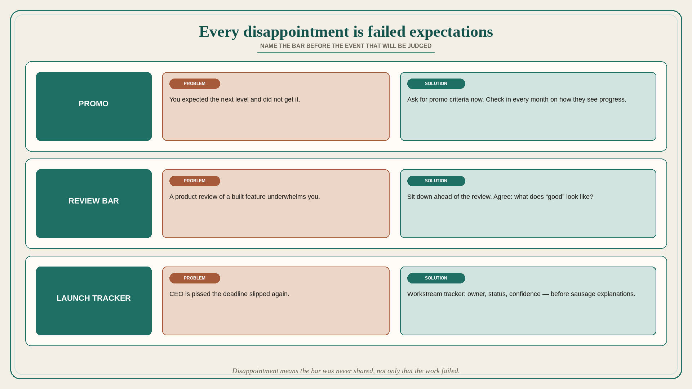

# Every disappointment is a failure to set expectations

**Source:** Julie Zhuo (@joulee)
**Post:** https://x.com/joulee/status/1536406812458487808

## What it claims

Every disappointment is a failure to set expectations. Four common examples, each with a problem and a solution. (1) You expect a promotion at your performance review and do not get it. The problem: you and your manager are not aligned on what “being at the next level” means. The solution: ask for promo criteria as soon as possible. Check in every month with your manager on how they see your progress. (2) You go through a product review of a recently built feature with your team. The experience underwhelms you. The problem: you are concerned whether your peers have a high enough bar. The solution: sit down ahead of the review with your team and agree on “What does ‘good’ look like?” (3) The CEO is pissed your project’s deadline slipped again. The problem: the CEO has no idea how the sausage is made and what is actually within your control. The solution: keep an updated tracker of workstreams that must complete for launch, with owner, status, and confidence level. (4) Your boyfriend gifts you speakers for your birthday, which is something he loves but you could not care less about. The problem: he does not really know what you like. The solution: send him your Pinterest boards for future gift ideas. (Zhuo still teases her husband about this.) The pattern is the same outside the personal example: name the expected bar before the event that will be judged.

## Why it matters for a PO

Missed promos, underwhelming reviews, and slipped-date rage look like performance problems. They are expectation problems. A PO who agrees “what good looks like” before the review, and who keeps a launch tracker with owner / status / confidence the CEO can see, is setting the bar instead of being surprised by it.

## 3 takeaways

1. Disappointment means the bar was never shared, not only that the work failed.
2. Product review: agree “what does good look like?” before you build, not after you underwhelm.
3. Slipped dates: a workstream tracker (owner, status, confidence) beats explaining sausage after the CEO is already pissed.

## Practice this week

For the next review or launch, write “good looks like” in one line with the trio, and publish a three-column tracker (owner / status / confidence) for the workstreams that must complete. Do it before the meeting that would otherwise produce disappointment.
