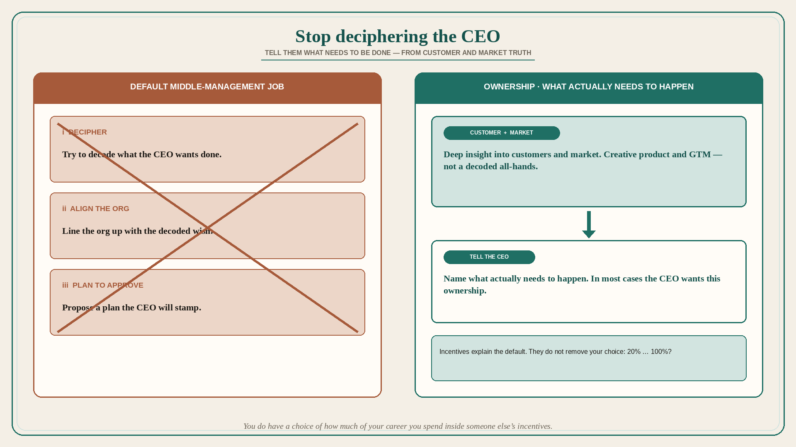

# Stop deciphering the CEO; tell them what needs to be done

**Source:** Shreyas Doshi (@shreyas)
**Post:** https://x.com/shreyas/status/1641336952988520448

## What it claims

Product life in midsized and large companies starts making a lot more sense when you understand that a large percentage of middle and upper management thinks their main job is to (i) try and decipher what the CEO wants done, (ii) align their org with it, and (iii) propose a plan that the CEO approves. This is instead of often telling the CEO what actually needs to be done, in a way that is grounded in (a) deep insight into customers and market and (b) creative product and GTM solutions. Many in middle and upper management will of course blame incentives set by the company for this. And they are not wrong. But it is worth evaluating how much of one’s career (and life) one wants to spend in aligning perfectly with incentives set by another party. 20% or 50% or 70% or 90% or 99% or 100%? What is your answer? The right answer will be different for each person. No one is going to judge you for your choice. But you should realize that, as a senior person who is already far along in your career, you do have a choice here. And when you realize that, you might just find that you also do have the ability to not always submit to external incentives and instead you can create much greater clarity on the truth and you can exercise your influence to help your CEO see what actually needs to happen. And if you consider this topic seriously enough, you might even discover the secret that, in the majority of cases, your CEO wants to see exactly this ownership attitude and behavior from the company’s middle and senior management. That is it. What you do with this info is up to you.

## Why it matters for a PO

A lot of “alignment” work is decoding the last all-hands and writing a plan the CEO will stamp. That is not product ownership. A PO who will spend some (not necessarily 100%) of their career telling the CEO what customers and the market require — with creative product and GTM, not a decoded plan — is doing the job most CEOs actually want from senior product people.

## 3 takeaways

1. Decipher → align org → plan-the-CEO-will-approve is the default middle-management job, not the product job.
2. Incentives explain the default; they do not remove your choice of how much of your career you spend inside them.
3. In most cases the CEO wants ownership that names what actually needs to happen from customer and market insight.

## Practice this week

Before the next plan-for-approval, write two versions: the decoded-CEO plan, and the “what actually needs to happen” plan grounded in one customer/market fact. Send the second. If you cannot name a fact, you do not have the insight yet — do not send a decoded plan in its place.
