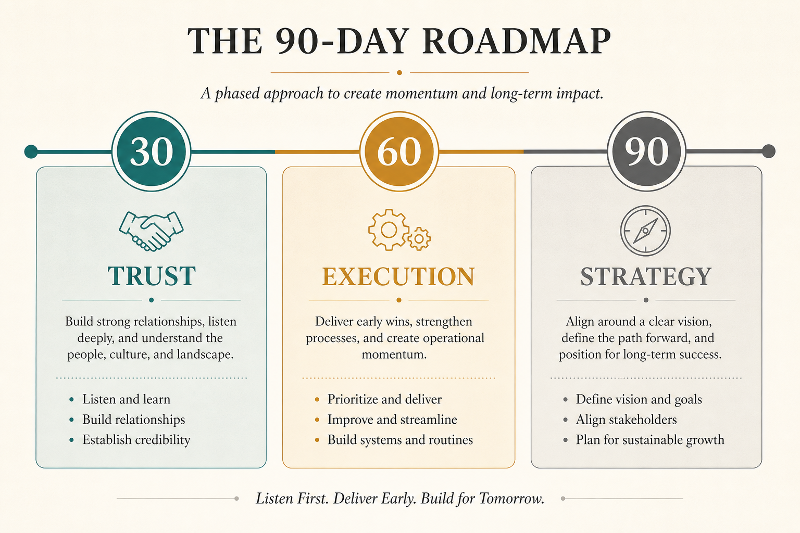

# First 30-60-90 days as a new PM

**Source:** Lenny Rachitsky (@lennysan)
**Post:** https://x.com/lennysan/status/1131260359233269760

## What it claims

Don’t start with a grand strategy. 30 days — trust: ask questions, learn deeply, land 2–3 quick wins that make the team’s life better. 60 days — execution: does everyone know what to do, are meetings waste, are blockers surfacing, are timelines shared. 90 days — strategy and vision: form your own view, then align the team on a 6–12 month roadmap worked backwards from a long-term vision.

## Why it matters for a PO

New POs are tempted to rewrite the backlog in week one and lose the room. Trust → execution → POV is a sequence that earns the right to change direction.

## 3 takeaways

1. Quick wins for the team beat a 90-day strategy memo.
2. Execution problems (meetings, blockers, timeline mismatch) are the 60-day job.
3. Strategy comes after you can describe how the team actually works.

## Practice this week

If you are new (or treating a new domain as new): list 2–3 team-pain quick wins and ship at least one. If you are past 90 days, write the 6–12 month POV you still haven’t socialized.
