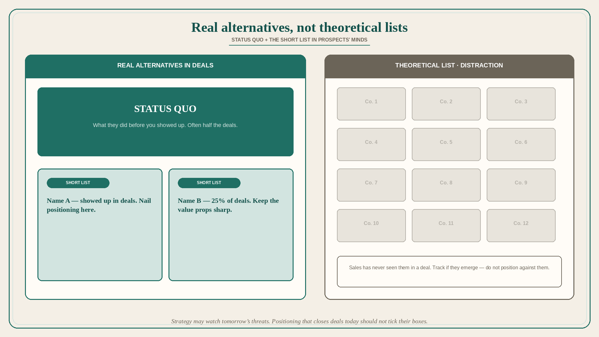

# Position only against real alternatives, not the theoretical list

**Source:** April Dunford (@aprildunford)
**Post:** https://x.com/aprildunford/status/1334143529573081089

## What it claims

Dunford has done a number of positioning workshops lately where the team has come with a detailed analysis of a very long list of competitors — so long, in fact, that it is almost a problem. Positioning is about figuring out how you are going to stand out from the competitive alternatives, so it makes sense that you would want to understand what those competitors are. But your positioning should only consider the real alternatives in the minds of prospects. Alternatives fall into two camps. The first is status quo — what they did before you showed up. The second is the short list of new products they evaluated before they chose you. Products that never make the short list are not real competitors, in Dunford’s opinion. Startups track many “theoretical” competitors but sales has never seen them in a deal. You may want to track them so you can shift if they emerge as a threat, but until they do, they are a distraction for sales and should not be considered in your positioning work. If half your deals are vs. status quo and 25% are vs. competitor X, you can just focus on nailing your positioning against those two. Narrowing it down helps you build a brand around a clear concise set of value props. Go beyond that and your positioning gets needlessly mushy. We need to make sure our positioning clearly defines our compelling differentiated value vs. the main alternatives we see in deals. We should never water that down to try to tick boxes against a set of “competitors” our customers have never even heard of. Positioning is not a set-it-and-forget-it exercise. You will shift it over time as your product, buyers, and competitors evolve. Your longer-term product strategy may take emerging threats into account. Positioning that helps you attract and close customers today should not.

## Why it matters for a PO

Competitive slides with twelve logos produce a mushy backlog that ticks boxes against vendors buyers have never heard of. A PO who positions against status quo plus the one or two names that actually show up in deals can keep differentiated value sharp — and leave emerging threats on the strategy horizon, not in this quarter’s stories.

## 3 takeaways

1. Real alternatives = status quo + the short list buyers actually evaluate; theoretical logos are not competitors yet.
2. Track emerging names if you must; do not let them dilute today’s value props or distract sales.
3. Strategy may watch tomorrow’s threats; positioning that closes deals today should not water down to tick their boxes.

## Practice this week

Ask sales for the last ten deals: status quo vs named short-list. Keep two names (plus status quo) on the positioning page. Remove one backlog item that only exists to match a vendor that has never appeared in a deal.
