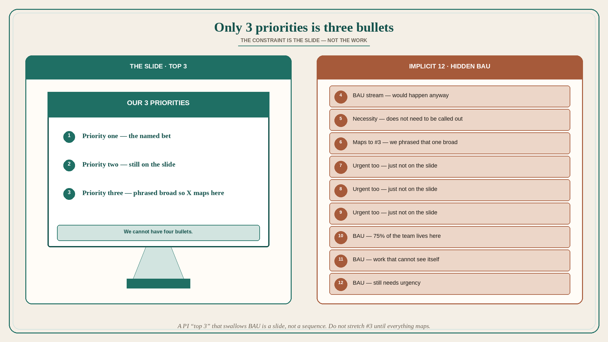

# “Only 3 priorities” is really three bullets on the slide

**Source:** John Cutler (@johncutlefish)
**Post:** https://x.com/johncutlefish/status/1571177832361111554

## What it claims

Leadership: it needs to be simple — you can only have 3 priorities. Cutler: does that map to what you are asking people to do? What about X? Leadership: that is business as usual — it does not need to be called out, it would happen anyway. It is a necessity. We cannot have four bullets. Just connect it to priority #3. We phrased that one broad. Cutler: so X maps to priority 3. What is a non-priority — could you list those? Leadership: that is too complicated. I do not want the people working on deprioritized things to feel undervalued. Cutler: but they will — those people are looking at the top priorities and not seeing their work connect. Leadership: true, but making it explicit is bad for morale. We need their work. I just cannot do 4 bullets. Cutler: but implicitly there are like 12 bullets. Leadership: OK. But we need urgency with these 3. Cutler: and not urgency with the other 9? Leadership: no, we need urgency there as well. It just does not need to be called out. Cutler: what about incentives — you have assigned people to these high-profile efforts; what signal does that send? Leadership: we trust them to do important things. Cutler: and you do not trust other people — the rest of the team doing 75% biz as usual? Leadership: you are driving me crazy. Cutler: it is really about three bullets, is it not? Leadership: YES. 3 bullets. Cutler: the slide? Leadership: YES.

## Why it matters for a PO

A PI “top 3” that swallows BAU, necessities, and nine other urgent streams is a slide, not a sequence. The trio still has ~12 bullets and 75% of people cannot see themselves on it. A PO who will name the implicit 12 — and who will not stretch priority #3 until everything maps — stops fake focus from becoming the plan.

## 3 takeaways

1. “Only 3 priorities” plus unnamed BAU is 12 priorities; the constraint is the slide, not the work.
2. Refusing to list non-priorities to protect morale still leaves people whose work is invisible — and still demands urgency on the hidden 9.
3. High-profile staffing signals trust; the 75% on “biz as usual” hears the opposite.

## Practice this week

Write the published top 3. Under them, list every in-flight item that is “BAU / necessity / maps to #3.” If the hidden list is longer than 3, take one hidden item to the next planning conversation as a fourth bullet — or drop it. Do not stretch #3 to absorb it.
