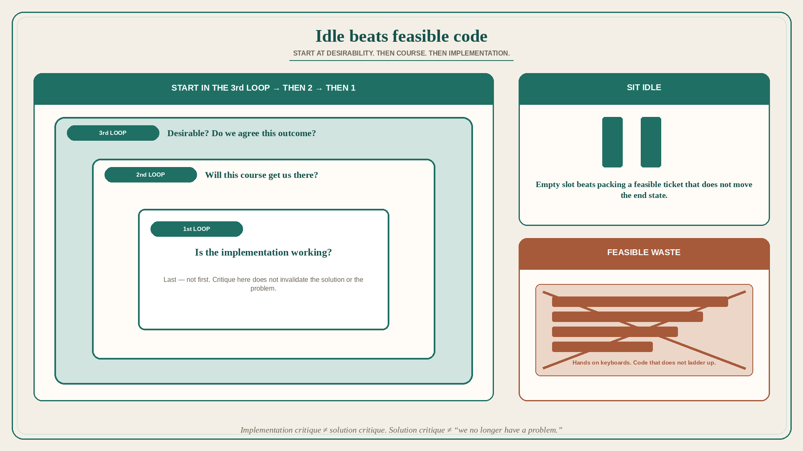

# Identify the problem first; sitting idle beats feasible code that does not ladder up

**Source:** Pavel A. Samsonov (@PavelASamsonov)
**Post:** https://x.com/PavelASamsonov/status/1605955904494452737

## What it claims

The first step to doing anything is identifying the problem you are solving. Critique of specific solutions or implementation challenges is not meaningful critique of the vision’s desirability. Start in the 3rd loop: is the thing we want to do desirable? Do we agree to work towards this outcome? Then the 2nd loop: is this course of action going to get us to that outcome? Only then the 1st loop: is the implementation working? Critique of the implementation does not invalidate the solution. Critique of the solution does not invalidate the shared vision of a problem that needs solving. “Feasible” actions that do not ladder up to a problem worth solving are pointless. The team is better off sitting idle than to rush to “hands on keyboards” and crank out code that does not accomplish anything because it is not moving the product towards the desired end state.

## Why it matters for a PO

Refinement that starts at “is this story implementable?” skips whether the outcome is even desirable. Feasible code that does not ladder up is still waste — and packing the sprint to avoid idle looks like delivery. A PO who will hold the 3rd loop (desirability / shared outcome) before the 1st (implementation) can kill a feasible story without killing the problem.

## 3 takeaways

1. Start at desirability of the outcome, then course of action, then implementation — not the reverse.
2. Implementation critique is not solution critique; solution critique is not “we no longer have a problem.”
3. Idle is better than feasible code that does not move toward the desired end state.

## Practice this week

For one in-flight story, write the three loops in order: (3) outcome we agreed is desirable, (2) why this course gets there, (1) whether the implementation is working. If (3) or (2) is empty, stop coding it. Sit idle on that slot rather than filling it with a feasible ticket.
