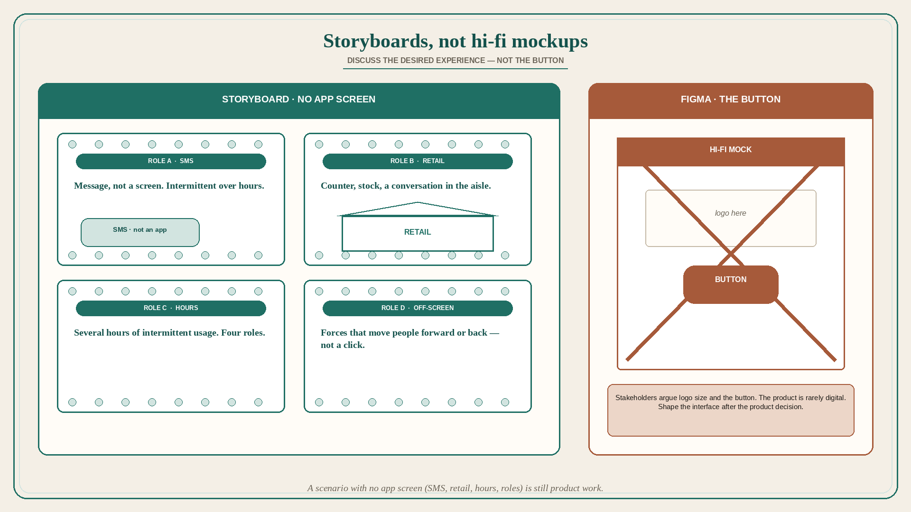

# Storyboards, not hi-fi mockups: discuss the desired experience, not the button

**Source:** Pavel A. Samsonov (@PavelASamsonov)
**Post:** https://x.com/PavelASamsonov/status/1600179126052085760

## What it claims

Storyboarding is a highly underrated design tool in the age of “well you can just use design system components to output a hi-fi mockup.” Storyboards serve a completely different purpose to mockups/wires — they focus the discussion on the desired experience and not just UI. Samsonov’s latest storyboard covers interactions between 4 different user roles, spans several hours of intermittent usage, and most importantly does not have a single app screen — the whole scenario takes place via SMS or retail interactions. The best part of using storyboards to anchor the conversation is that stakeholders spent the entire time discussing whether this was the experience we wanted to deliver and never once asked to make the logo bigger or move the button. Treating Figma as the only medium of design artifacts obscures that the product is very rarely digital. Only the interface is digital. It is the most malleable thing about the product, and so should be shaped after product decisions and not be shaping those decisions. The mockup-centric approach also erases the action happening outside of the screen — the various dynamics that compel the user to move either forward or back along the user journey, that have nothing to do with the button they click.

## Why it matters for a PO

A Figma-ready story trains stakeholders to argue logo and button. A storyboard of roles, hours, SMS, and retail trains them to argue whether this is the experience to deliver. The product is rarely the screen; the screen should be shaped after the product decision. A PO who will not accept “design system → hi-fi → ready” as the only artifact keeps off-screen journey dynamics in the conversation.

## 3 takeaways

1. Storyboards discuss desired experience; mockups discuss UI. They are not interchangeable.
2. A scenario with no app screen (SMS, retail, hours, multiple roles) is still product work.
3. Figma-only artifacts make the interface decide the product, and erase the off-screen forces that move people forward or back.

## Practice this week

Before the next refinement of a UI-heavy story, write a one-page storyboard with roles, time span, and off-screen steps — no screens. Run the conversation on “is this the experience we want to deliver?” Do not open the mock until that answer exists.
