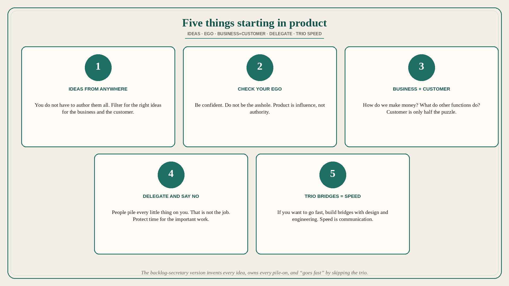

# Five things starting in product: ideas, ego, business+customer, delegate, trio speed

**Source:** Melissa Perri (@lissijean)
**Post:** https://x.com/lissijean/status/1560318539009064960

## What it claims

Five things Perri wishes she could go back and tell herself when she was starting in product management. (1) You do not have to come up with all the ideas. Ideas can come from anywhere. It is your job to make sure they are the right ideas for the business and the customer. (2) Check your ego. While being confident when communicating is important as a Product Manager, you do not want to be perceived as an asshole. Product management is about influence, not authority. (3) Spend more time getting up to speed on the business as well as the customer. How do we make money? What do all the other functions do? How does software further our mission? Understanding the customer is key, but it is only half of the puzzle. (4) Delegate and prioritize. People will try to pile every little thing on you, and you love owning it all. But that is not your job. Make time for the important things, and say no to things that are not your job if it is preventing you from getting things done. (5) If you want to go fast, spend your time building bridges between your design and engineering counterparts. Speed comes from communication.

## Why it matters for a PO

The backlog-secretary version of the role invents every idea, owns every pile-on, and “goes fast” by skipping the trio. Perri’s five reverse that: filter ideas for business and customer, influence without being the asshole, learn how the company makes money (customer alone is half), say no so the important work exists, and put speed in the design–eng bridges.

## 3 takeaways

1. The job is the right ideas for business and customer, not authorship of every idea.
2. Influence not authority; customer plus how we make money, other functions, and the mission.
3. Delegate and say no; speed comes from trio communication, not from owning everything.

## Practice this week

Pick one piled-on task that is not the PO job and say no or delegate it. Spend the freed slot on one of: (a) how this epic makes money, or (b) a 30-minute bridge with design and eng on the next story — not another ticket you authored.
