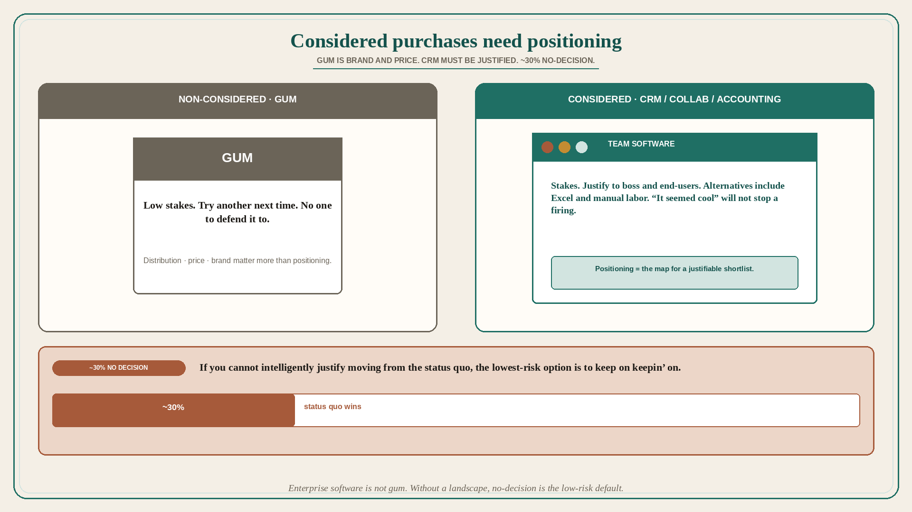

# Positioning matters more for considered purchases; no-decision is the low-risk default

**Source:** April Dunford (@aprildunford)
**Post:** https://x.com/aprildunford/status/1454119145805697027

## What it claims

Positioning is more important for a considered purchase than for a non-considered purchase. In a considered purchase the stakes are higher and we need to justify a purchase to other people; positioning helps us do that. If Dunford buys a pack of gum, the stakes are low so she does not need to weigh options too much. If she does not like the choice, she tries another next time. She does not have to defend the choice to anyone else. Distribution, price, and brand matter more than positioning. If the boss asks her to choose collaboration software or CRM or an accounting system for the team, the decision matters. If she does not choose wisely, it makes her look bad. If she does a good job, she might get rewarded. This is a considered purchase because there are stakes. She has to justify the choice to boss and end-users. She needs to understand the alternatives (including Excel / manual labor) and why the business should or should not pick them. Understanding the entire landscape is a lot. No wonder 30% of purchase processes end in “no decision” — if you cannot intelligently justify moving from the status quo, the lowest-risk option is to keep on keepin’ on. Good positioning gives buyers a way to think about the entire landscape, and how your solution fits in it, so they can intelligently narrow a shortlist they can justify. For B2B software you cannot sell the boss with branding, and telling end-users “hey, it seemed cool” will not stop them from getting you fired if they hate it.

## Why it matters for a PO

Enterprise software is not gum. The champion has to defend the choice to a boss and to people who can get them fired. Without a landscape (including Excel / status quo), the low-risk move is no decision — Dunford cites ~30%. A PO who treats positioning as “branding” is leaving the buyer without a justifiable shortlist, which shows up as stalled deals and a backlog aimed at looking cool.

## 3 takeaways

1. Considered purchases need positioning because the buyer must justify the choice to other people; gum-style brand/price/distribution is not the job.
2. Alternatives include Excel and manual labor; without a landscape, ~30% end in no decision — status quo is lowest risk.
3. Positioning is the map that lets a champion narrow a shortlist they can sell inside the org; “it seemed cool” will not.

## Practice this week

For one in-flight B2B bet, write the considered-purchase defense in three lines: alternatives including status quo / Excel; why move; how a champion would justify this to a boss and an end-user. If any line is “it looks modern,” the story is not positioned.
