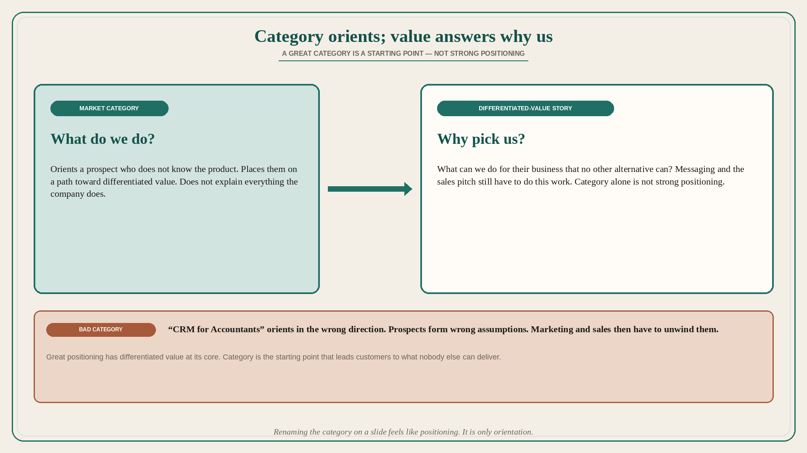

# Market category orients; the differentiated-value story answers “why pick us”

**Source:** April Dunford (@aprildunford)
**Post:** https://x.com/aprildunford/status/1613246686612099072

## What it claims

Everyone understands that choice of market category is an essential aspect of positioning. That said, companies sometimes focus too much on the category at the expense of getting very clear on the story around their differentiated value. The job of a market category is a starting point for customers. It takes a prospect that does not know too much about the product and places them on a path that leads to differentiated value. It does not explain everything the company does and all of the value delivered — marketing messaging and the sales pitch still have to do that work — but it ensures prospects are oriented in the right direction. A bad market category orients customers in the wrong direction. It sparks a set of wrong assumptions about the product and gives marketing and sales the extra work of turning those incorrect assumptions around. If you describe the product as a “CRM for Accountants,” prospects form a picture based on their assumptions about what a CRM is and how that might work for accountants. But the market category alone can only take a prospect so far. To win business, messaging and a sales pitch must help customers understand differentiated value — what can we do for their business that no other alternative can? A great market category can help answer “What do we do?” but we need to pair that with a story around differentiated value to answer “Why pick us over the alternatives?” A great market category alone does not result in strong positioning. Great positioning has differentiated value at its core.

## Why it matters for a PO

Renaming the category on a slide feels like positioning work. It is only orientation. If the backlog is built to look like “CRM for X,” sales inherits wrong assumptions and still cannot answer why pick us. A PO who treats category as the path to differentiated value — and who sequences stories that prove what no alternative can do — is doing the actual positioning job.

## 3 takeaways

1. Category orients a prospect onto a path; it does not carry the whole value story.
2. A bad category creates wrong assumptions that marketing and sales then have to unwind (“CRM for Accountants”).
3. Strong positioning = category as starting point + a differentiated-value story that answers why pick us over alternatives.

## Practice this week

Write two sentences for the current product: (1) category — what do we do? (2) differentiated value — what can we do that no alternative can? Check the next three stories: do they prove sentence 2, or only decorate sentence 1? Cut or retag one that is category-costume only.
