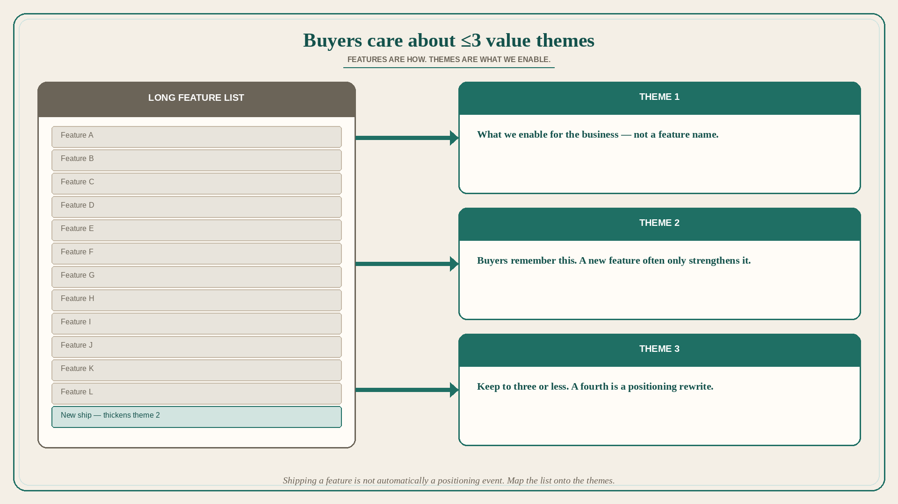

# Buyers care about ≤3 value themes, not the feature list

**Source:** April Dunford (@aprildunford)
**Post:** https://x.com/aprildunford/status/1552978763725516801

## What it claims

Buyers do not care about features; they care about the value those features enable. The core of good positioning is differentiated value. We may have thousands of cool differentiated features, but we try to keep the number of value themes we message around small — ideally 3 or less. Buyers cannot digest, understand, and remember more than that. When we develop positioning we go through the very long list of features and map them all to a very small number of value themes. Those themes become the core of messaging. The value is “what” we enable for a customer’s business; the features are “how” we do it. When we ship new features, often they serve to strengthen an existing value theme. In that case positioning and messaging do not change. If we ship something that enables a new value theme, then we have to rework the positioning and update the messaging that flows from it.

## Why it matters for a PO

Shipping a feature is not automatically a positioning event. Most new capabilities should thicken an existing theme (the “what” for the customer’s business), not add a fourth theme buyers will not remember. A PO who maps the backlog to ≤3 value themes can refuse theme-proliferation stories and can skip a messaging rewrite when the theme did not change.

## 3 takeaways

1. Features are how; value themes are what we enable — buyers remember ≤3 themes, not thousands of features.
2. Positioning work is mapping the long feature list onto those few themes.
3. New features that strengthen an existing theme do not change positioning; a new theme does, and then messaging must be reworked.

## Practice this week

Name the current ≤3 value themes. Tag every in-flight story to one of them. If a story needs a fourth theme, either drop it or schedule the positioning rewrite before you sequence the story. If it only strengthens theme 2, do not open a “new messaging” ticket.
