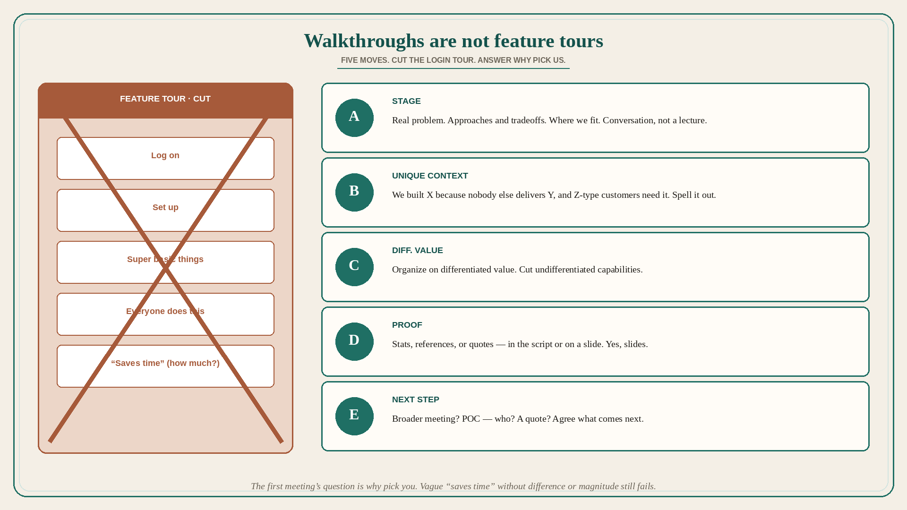

# Product walkthroughs suck when they are feature tours; five moves

**Source:** April Dunford (@aprildunford)
**Post:** https://x.com/aprildunford/status/1560640569801461761

## What it claims

Product walkthrough demos generally suck; doing a good one is easy. Customers come to the first sales meeting with one big question — why pick you over the alternatives? Most product walkthroughs do not answer that. Most are focused on features and not why the features matter: what value those features can deliver, why a customer should care. Worse than being too feature-focused, they waste a crazy amount of time on features that are not the tiniest bit differentiated — dozens start with “here’s how you log on, set up, and do super basic things.” Everyone does that stuff. Some address value but do not go far enough: “you want to save time? This will help you save time.” Competitors also help prospects save time. How are you different? How much time — a minute? A year? Walkthroughs rarely address competition or position the product in the context of other approaches. Five things that make a walkthrough great: (A) Before the walkthrough, set the stage — real problem, approaches and tradeoffs, where we fit; a conversation, not a lecture. (B) Give customers the context to understand what makes it unique: “We built X because nobody else delivers Y value, and we know Z type of customer needs it.” (C) Organize the walkthrough around the product’s differentiated value and how it is delivered; cut undifferentiated capabilities. (D) Include proof — statistics, customer references, or quotes, in the script or on a slide. (E) End with an agreement on what comes next — broader meeting, POC and who is involved, or a quote.

## Why it matters for a PO

A PO who “just demos the build” is running the feature tour Dunford is attacking: login, setup, undifferentiated basics, vague “saves time.” The first meeting’s question is why pick us. Sequence the walkthrough as stage → unique context → differentiated value → proof → next step, and cut the login tour. That is product work, not a sales-enablement afterthought.

## 3 takeaways

1. The walkthrough must answer why pick you; a feature tour (especially login/setup) does not.
2. Vague value (“saves time”) without difference, magnitude, or other approaches still fails.
3. Five moves: stage the problem and tradeoffs; spell unique context; organize on differentiated value; prove it; agree the next step.

## Practice this week

Rewrite one demo script with A–E as headings. Delete the login/setup section. Put one proof artifact (stat, reference, or quote) next to the differentiated-value segment. End with a named next step (broader meeting / POC / quote) instead of “any questions?”
