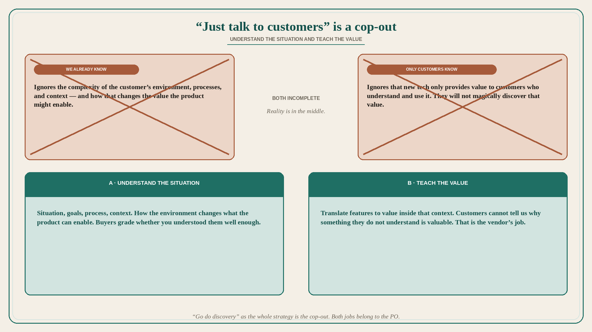

# “Just talk to customers” is a cop-out

**Source:** April Dunford (@aprildunford)
**Post:** https://x.com/aprildunford/status/1559206273010352128

## What it claims

Saying “just talk to customers” feels like a lazy cop-out. Some companies think customers know everything about why their product is valuable. Some companies think they know everything about why their product is valuable for buyers. The reality is always in the middle. The “we know what’s good for customers” crowd often ignores the complexity of the customer’s environment, processes, context, and how that impacts the value of what a product might enable for buyers. The “only customers know what’s valuable” crowd often ignores that new tech/features can only provide value to customers that understand and use them. If we fail to teach customers why something is valuable, we cannot expect them to magically discover that value. We need to understand the customer’s situation, goals, and context. Teaching customers how something new can deliver value to them within their context is on us as vendors. Buyers get to evaluate whether we understood their situation well enough to do that job successfully. Success as vendors depends on (a) understanding the situation customers are in, then (b) using that knowledge to translate features to value for buyers. Customers cannot tell us why something they do not understand is valuable to them. That is our job.

## Why it matters for a PO

“Go do discovery” as the whole strategy is the cop-out. Customers will not magically name the value of a thing they do not understand; vendors who skip context will pitch value that does not survive the customer’s environment. A PO has both jobs: learn situation/goals/context, and teach how the new thing delivers value inside that context. Buyers grade whether you understood them well enough to teach.

## 3 takeaways

1. “Just talk to customers” and “we already know what’s good for them” are both incomplete; the reality is in the middle.
2. New features only create value for customers who understand and use them — teaching that value is the vendor’s job, not a magical discovery.
3. Understand situation, then translate features to value in that context; customers cannot explain the value of something they do not understand.

## Practice this week

After the next customer conversation, write two lists: (a) situation / process / context you learned, (b) the value you still have to teach because they cannot see it yet. Do not add a feature from (b) until the teaching path exists. Do not ship a pitch from internal conviction that ignores (a).
