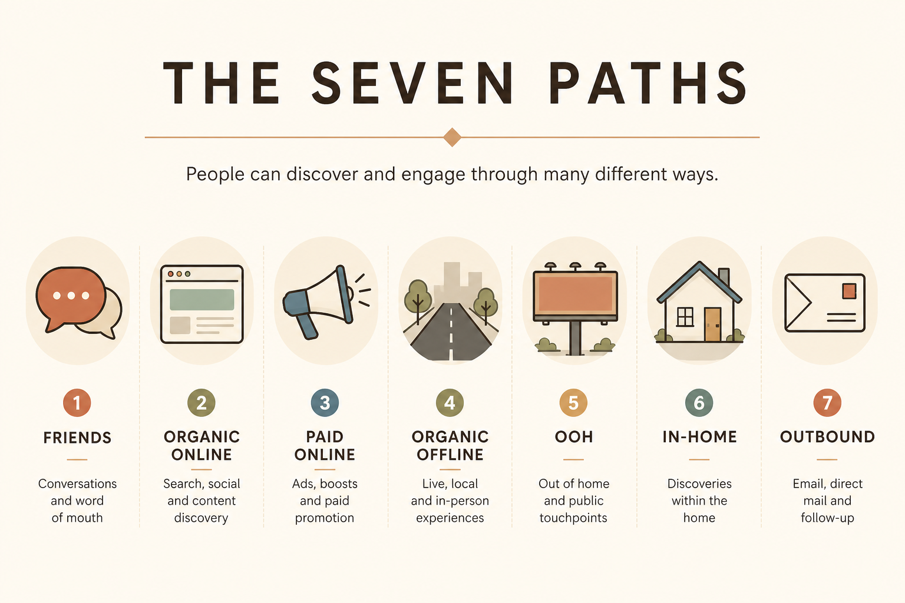

# Seven ways people discover products

**Source:** Lenny Rachitsky (@lennysan)
**Post:** https://x.com/lennysan/status/1402288226509885444

## What it claims

There are seven paths: friends/colleagues tell you; you come across it organically online; you come across a promotion online; organically in the physical world; out-of-home paid; in-home paid; outbound sales. Cheap/organic sits at the top; paid and outbound are explicit spends. Channel choice should follow how your buyers actually notice new products.

## Why it matters for a PO

POs often own activation and sharing surfaces without owning ads. Mapping discovery to these seven stops building invite loops for a product people only find via sales, or SEO pages for a product people only find via friends.

## 3 takeaways

1. Organic WOM and organic online are the cheapest; design for them only if they are real.
2. Paid online vs OOH vs in-home vs outbound are different products, not one growth backlog.
3. Pick channels worth the team’s time, not every channel.

## Practice this week

Interview 5 recent customers: “How did you first hear about us?” Bucket answers into the seven paths; put more than half of next-sprint discovery work on the top bucket.
