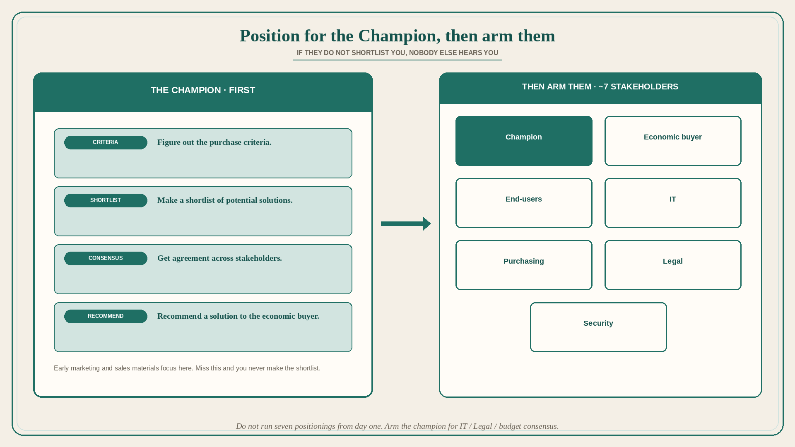

# Position first for the Champion, then arm them

**Source:** April Dunford (@aprildunford)
**Post:** https://x.com/aprildunford/status/1500142855586820104

## What it claims

If multiple folks are involved in a purchase decision, do we need different positioning for each persona? In a typical enterprise B2B sale there are 7 stakeholders. There is an economic buyer (who holds the budget), end-users, sometimes other departments like IT, Purchasing, Legal, Security — that all need to agree for a deal to get done. Each might have different requirements. Typically there is a Champion. This person is often tasked with figuring out the purchase criteria, making a shortlist of potential solutions, getting consensus across stakeholders, and finally recommending a solution to the economic buyer. Positioning for the champion is hugely important. If it does not resonate with them, you are not making the shortlist, and you do not even get the chance to make your case to anyone else. Marketing and initial sales materials need to be focused on this champion. Once you have made the shortlist and a deal is in motion, often the champion is the person working across teams to get consensus. Our job is to help them make that case — either directly or by teaching them to do it — but we are generally always working with the champion. So: focus positioning efforts primarily on the champion in the early stages of a deal, and then be prepared to support the champion’s efforts to get the rest of the stakeholders on board.

## Why it matters for a PO

Building a persona deck for all seven stakeholders (econ buyer, end-users, IT, Purchasing, Legal, Security) before you have a champion is busywork. If the champion does not put you on the shortlist, nobody else hears you. A PO who positions first for the person who sets criteria, shortlists, and recommends — then arms that person for IT/Legal/budget consensus — matches how complex B2B actually buys.

## 3 takeaways

1. ~7 stakeholders with different requirements; the Champion sets criteria, shortlists, builds consensus, and recommends to the economic buyer.
2. Early positioning and marketing must resonate with the champion or you never make the shortlist.
3. After the shortlist, the job is to arm the champion (directly or by teaching them) for the rest of the org — not to run seven separate positionings from day one.

## Practice this week

Name the champion for one live deal or target segment (role, not a fictional persona pack). Rewrite the one-pager for that person only. Add a second page that they can take to IT / Legal / economic buyer. Do not start a seventh persona until the champion page exists.
