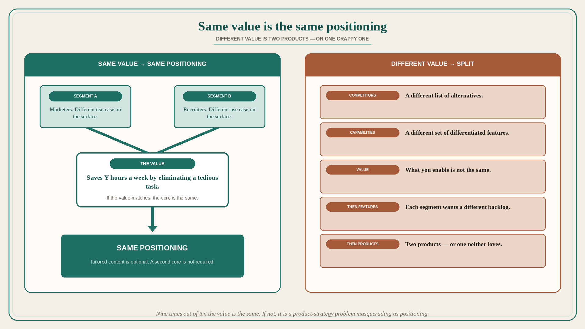

# Same value across segments is the same positioning; different value is two products

**Source:** April Dunford (@aprildunford)
**Post:** https://x.com/aprildunford/status/1552991234959896577

## What it claims

It is not unusual to have a product that serves multiple customer segments (marketers, recruiters) with different use cases. What really matters is the value — e.g. saves you Y hours a week by eliminating a tedious task. If the value is the same, the positioning is the same for both segments. You might create some content aimed specifically at one or the other, but the core is the same. In some cases the value is completely different: different competitors, different list of differentiated capabilities, different value. Then you need totally different positioning for each segment. If that is true, each segment will also want completely different features moving forward. Eventually you have two different products — or one crappy product that neither segment loves anymore. Nine times out of ten, if you are serving multiple segments, even though it might not seem like it on the surface, the value is the same. If it is not, you generally have a long-term product-strategy problem masquerading as a positioning problem.

## Why it matters for a PO

“We need a recruiter version and a marketer version” often arrives as a positioning request. Dunford’s test is value, not persona labels. Same value → same positioning (content can vary). Different value → you are about to split the backlog into two products, or ship one product neither segment loves. A PO who will name that as a product-strategy problem — not a messaging tweak — can refuse the second theme-pack before it becomes two roadmaps.

## 3 takeaways

1. Same value across segments → same positioning; tailored content is optional, a second core is not required.
2. Different value / competitors / capabilities → different positioning, then different feature demand, then two products or one crappy one.
3. Nine times out of ten the value is actually the same; if it is not, it is a long-term product-strategy problem masquerading as positioning.

## Practice this week

Pick two segments the backlog is serving. Write one sentence of value for each (what we enable, not who they are). If the sentences match, do not open a second positioning. If they do not, write the two-product implication before sequencing another “for segment B” story.
