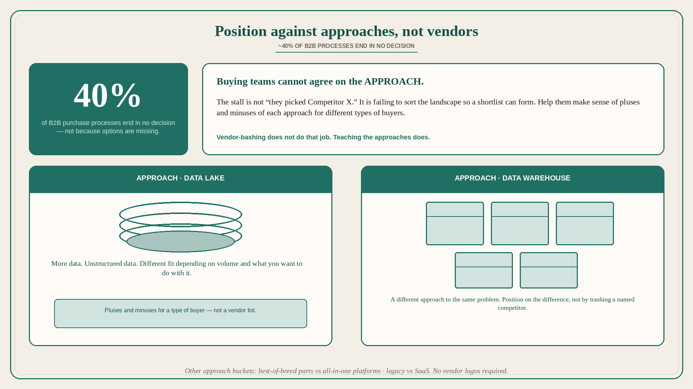

# Position against approaches, not vendors; 40% end in no decision

**Source:** April Dunford (@aprildunford)
**Post:** https://x.com/aprildunford/status/1513539070550589451

## What it claims

Startups often avoid talking about competitors because they do not want to call attention to other alternatives, or do not want to be seen as trashing the competition. Those reasons make sense, but it is possible to position against alternatives in a way customers appreciate. Research tells us that 40% of B2B purchase processes end in “no decision.” That is not because there are not good options. It is because there are so many options that buying teams cannot agree on the approach to solving the problem in order to narrow a shortlist. The job in B2B marketing/sales should be to help customers make sense of the landscape: sort competitors by approach and teach the pluses and minuses of those approaches for different types of buyers. Example: manage data in the cloud → cloud data warehouse or cloud data lake; pros and cons depend on how much data you have and what you want to do with it. A lake vendor can position against warehouse vendors on differences (more data, unstructured data) without trashing individual competitors. If you are doing something new, compare it to both. Google’s BigLake describes the evolution from lakes to warehouses and the current challenges neither handles well (the data swamp). They are not focused on specific vendors; they are positioning against the other approaches in the market today. Sometimes the buckets are less obvious: best-of-breed piece parts strung together vs all-in-one platforms; legacy vendors vs SaaS. Being able to clearly articulate how you position against each competing approach helps customers make informed choices and increases the chances that good-fit customers pick you.

## Why it matters for a PO

A competitive slide that names vendors is the bash Dunford is warning against. The stall is not “they picked Competitor X”; it is the buying team failing to agree on approach — she cites 40% no-decision. A PO who maps lake vs warehouse (or parts vs platform, legacy vs SaaS) and sequences stories that prove the value this approach delivers that the other cannot is doing the shortlist work, not vendor-bashing.

## 3 takeaways

1. ~40% of B2B processes end in no decision because teams cannot agree on approach — not because options are missing.
2. Position against approaches (lake vs warehouse, parts vs platform, legacy vs SaaS), not individual vendors.
3. A new offering (BigLake) should name what neither existing approach delivers, regardless of vendor.

## Practice this week

For one in-flight B2B bet, write two competing approaches (not two vendor logos). One line each: pluses, minuses, who it fits. One line for what we do that neither approach does. If you only have vendor names, you do not have positioning yet.
