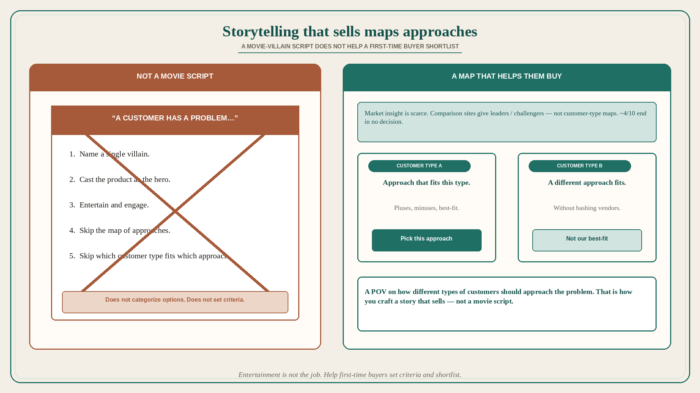

# B2B storytelling that sells maps approaches for types of customers

**Source:** April Dunford (@aprildunford)
**Post:** https://x.com/aprildunford/status/1349820125998948352

## What it claims

There has been so much written about storytelling but so little focused on how we know we are telling the right stories. The goal of B2B storytelling is not just to engage and entertain — it is to help customers buy. Often B2B buyers have never purchased a solution like ours before. They first have to make sense of their options and decide what criteria they should use to build a shortlist. That is very hard. There are endless comparison sites, but they do not categorize solutions for particular types of customers beyond overall market “leaders” or “challengers.” Product information is unlimited. Market insight is scarce. No wonder 4/10 purchase processes end in “no decision.” Most storytelling exercises ignore this. The story of “a customer has a problem…” does not map a market. There is not a single “villain” for B2B buyers — these stories do not help customers categorize different approaches to solving the problem so they can make choices. Vendors are perfectly qualified to do this. Every successful company Dunford has worked with has a very distinct point of view on how their best-fit customers should evaluate solutions. But they often avoid talking about it because they do not want to mention “competitors.” Customers are not interested in hearing you bash your competitors either. They want a deeper understanding of how your approach to the problem differs from other approaches, and what types of customers are the best fit for each. Help customers make purchase decisions by telling a compelling story about your point of view on how different types of customers should approach solving a particular problem. That might not be how you write a movie script — but that is how you craft a story that sells.

## Why it matters for a PO

A “customer has a problem / we are the hero” demo is a movie script. It does not give a first-time buyer criteria or a map of approaches, so comparison sites’ leader/challenger labels fill the gap and ~4/10 stall. Distinct from already-used positioning-before-storytelling (125444); this is the story after you have a POV: which customer types should pick which approach. A PO who will write that map — and refuse the villain script — is doing sales-enablement as product work.

## 3 takeaways

1. B2B storytelling that sells helps first-time buyers set criteria and shortlist; entertainment is not the job.
2. Comparison sites give leaders/challengers, not customer-type maps; market insight is scarce; ~4/10 end in no decision.
3. A movie-villain “customer has a problem” story does not categorize approaches; a POV on which types of customers fit which approach does — without bashing.

## Practice this week

Rewrite one pitch without a villain. Replace it with: two customer types, the approach that fits each, and why our best-fit type should pick us. If the only story is “they have a pain,” it is not a story that sells.
