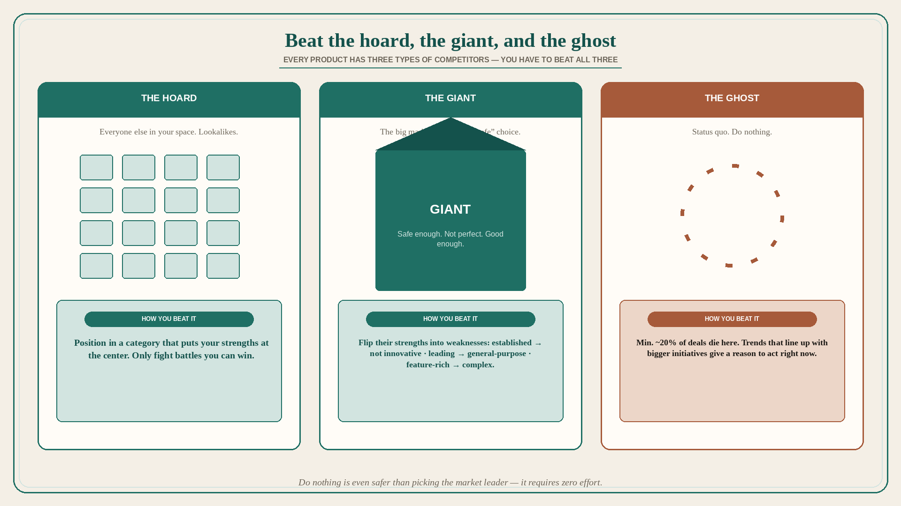

# Beat the hoard, the giant, and the ghost

**Source:** April Dunford (@aprildunford)
**Post:** https://x.com/aprildunford/status/1236305794024554496

## What it claims

Every product has three types of competitors — the hoard (everyone else in your space), the giant (the big market leader), and the ghost (the status quo) — and you have to beat all three. First, stand out from the hoard of competitors who look like you. Positioning strategically in a market category that puts your strengths at the center helps you stand out; it focuses sales/marketing so you only compete where you can win. Even after you beat the hoard, you have to beat the giant: the big company in your space, the “safe” choice that is not perfect but good enough. To beat them you have to actively position them so that their strength is a weakness. The leaders are “established” but also “not innovative”; “market leading” but also “general purpose”; “feature-rich” but also “complex.” Focus on buyers for whom the giant’s strengths are actually negatives, and position for that. Then you still have to beat the ghost: status quo / “do nothing.” Dunford has seen research that a minimum of 20% of deals die here. Do nothing is even safer than picking the market leader because it requires zero effort. To fight the status quo you have to give buyers a real reason to act right now. Strategic use of trends in your positioning can help: it helps buyers see how your product lines up with bigger initiatives, and the downside of not acting right now. Recap: beat the hoard by positioning to only fight battles you can win; beat the giant by positioning their strengths as weaknesses; beat the status quo by putting your offering in the context of a larger trend so buyers understand why they need to act right now.

## Why it matters for a PO

A backlog aimed only at “looking different from the other startups” fights the hoard and still loses to Salesforce-as-safe and to do-nothing. Distinct from already-used competitor-positioning (120054) and considered-purchase no-decision (145411, ~30%): here the ghost is at least 20%, and the move is trends + why act now. A PO who sequences work for all three — category that centers strengths, giant-strength-as-weakness for a specific buyer, trend that makes delay costly — is not running a feature bake-off against lookalikes.

## 3 takeaways

1. Three competitors: hoard (lookalikes), giant (safe-enough leader), ghost (do nothing) — you have to beat all three.
2. Category that puts strengths at the center beats the hoard; flipping the giant’s strengths (established / general-purpose / feature-rich) into weaknesses beats the giant.
3. Ghost/do-nothing kills a minimum of ~20% of deals; trends that line up with bigger initiatives give a reason to act now.

## Practice this week

Write one line each: how we are not the hoard; which giant strength is a negative for our buyer; what trend makes delay costly. If any line is empty, that is the positioning gap — do not add a lookalike feature to “compete.”
