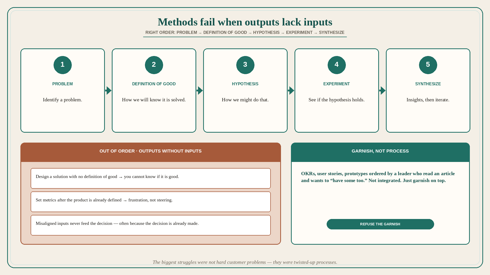

# Product methods fail when outputs are demanded without inputs

**Source:** Pavel A. Samsonov (@PavelASamsonov)
**Post:** https://x.com/PavelASamsonov/status/1534698419377291266

## What it claims

Product design methods are both much tougher to do and much less impactful when done out of order. Samsonov’s biggest struggles at work were not caused by challenging customer problems, but by twisted-up processes that demanded outputs without the requisite inputs. When you do things in the right order, everything flows smoothly: identify a problem; define how we will know we have solved it; develop a hypothesis for how you might do that; design the experiment to see if the hypothesis holds; synthesize insights and iterate. The problems appear when these steps do not follow one another. Designing a solution when there is no definition of good is futile, because you cannot know whether it is good or not. Setting metrics after the product has already been defined is an exercise in frustration. Methods are also less impactful when inputs are misaligned: whatever you cobble together for metrics or research does not feed into the decisions it is supposed to — often because those decisions have already been made. Frequently they are treated as deliverables, ordered by a leader who does not understand what they are for, but has read an article about “OKRs” or “user stories” or “prototypes” and wants to have some too. Not integrated into the process — just as a garnish on top.

## Why it matters for a PO

A sprint that starts with “write the stories / pick the OKR / make a prototype” after the build is already chosen is garnish. Designing without a definition of good is futile; metrics after the product is defined cannot steer it. A PO who will hold the order — problem, definition of solved, hypothesis, experiment, then synthesize — can refuse the garnish OKR and the post-hoc metric.

## 3 takeaways

1. Right order: problem → how we will know it is solved → hypothesis → experiment → synthesize and iterate.
2. No definition of good → you cannot know if the design is good; metrics after the product is defined are frustration.
3. OKRs, user stories, and prototypes ordered as leader-requested deliverables are garnish if they do not feed the decision (often already made).

## Practice this week

For one in-flight story, write the five steps in order. If “definition of good” or “hypothesis” is empty, stop the prototype/OKR garnish. Do not set a metric after the solution is already locked.
