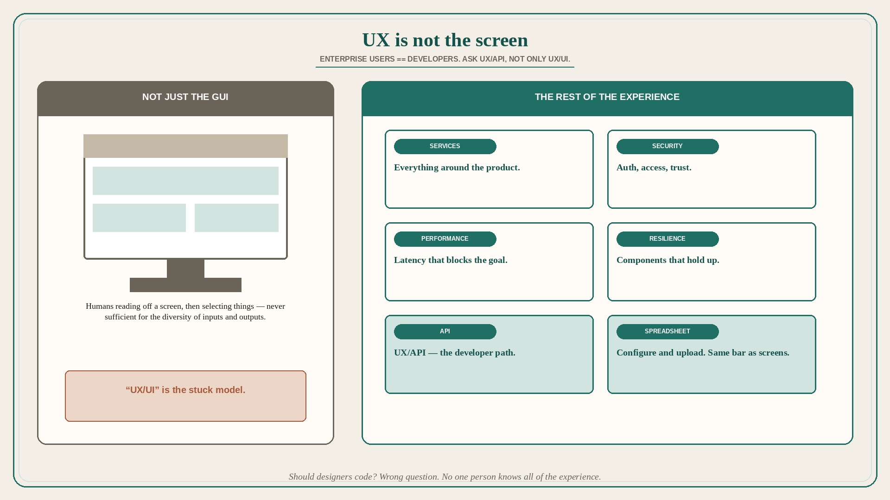

# UX is not the screen; enterprise users are developers

**Source:** Pavel A. Samsonov (@PavelASamsonov)
**Post:** https://x.com/PavelASamsonov/status/1067802984418021376

## What it claims

UX is not just the graphical interface, but also everything that underlies it: the services around a product, its security, the performance and resilience of its components, and everything else that impacts the user’s ability to achieve their goal. Many designers get stuck on “humans reading off the screen, then selecting things” as a model of human-computer interaction; that has never been sufficient to describe the diversity of available inputs and outputs. Miss “UX/UI” — what about “UX/API”? For enterprise software, users == developers. They drive large-scale business processes, and need the user experience of using your API (or configuring and uploading the Excel spreadsheet) to be just as good as clicking on screens. For consumer products, a wealth of input data is available — device location/orientation, browsing history, Facebook surveillance data. The designer must understand these flows to ensure that the user’s data is used properly, securely, and transparently. “Should designers code” is not a sufficient question. Should designers be software architects? Should software architects be designers? Is it (or has it ever been) reasonable to suggest that any one person can know ALL the things necessary to design a user experience?

## Why it matters for a PO

Enterprise backlogs that only sequence screen stories treat the API and the Excel upload as “eng leftover.” Samsonov’s claim is that those are the UX for the people who run the process. A PO who will put API/Excel/service/security/performance on the same experience bar as the GUI — and who will not reduce the trio to “should designers code?” — keeps the actual user (often a developer) in the story.

## 3 takeaways

1. UX includes services, security, performance, and resilience — not just the GUI.
2. Enterprise: users == developers; API and Excel UX must be as good as screens. Ask “UX/API,” not only “UX/UI.”
3. “Should designers code?” is the wrong question; no one person knows all of the experience.

## Practice this week

Pick one enterprise story that only specifies a screen. Add the API or Excel path a developer/operator actually uses, plus one non-GUI failure (auth, latency, a service around the product). If that path is “out of scope,” the story is not the experience.
