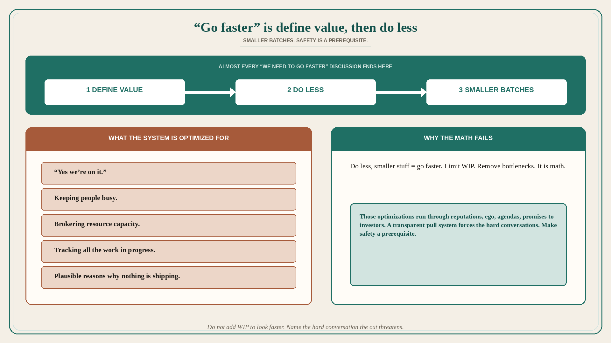

# “Go faster” is define value, do less, and make safety a prerequisite

**Source:** John Cutler (@johncutlefish)
**Post:** https://x.com/johncutlefish/status/1009935557491748865

## What it claims

Almost every discussion Cutler has that starts with “we need to go faster” ends with him asking the team to “define value,” and then do less once and work in smaller batches. It is at this point that the reality sets in: the current system is optimized for saying “yes we’re on it,” keeping people busy, brokering resource capacity, keeping track of all the work in progress, and providing plausible reasons why nothing is shipping. This should be easy to unwind, right? It is math. Do less, smaller stuff = go faster. Limit WIP; discover/remove bottlenecks. Well no — because those optimizations run so deep: reputations, ego, agendas, promises to investors. And probably hardest of all: in a pull system that is transparent, there is no way to avoid having the hard conversations. You either face your issues, or you do not. Which highlights the modern agile principle: “Make safety a prerequisite.”

## Why it matters for a PO

“Go faster” in PI planning usually means more stories in flight, not a definition of value. Cutler’s sequence is define value → do less → smaller batches. The system is optimized for yes-we’re-on-it and plausible reasons nothing ships; limiting WIP threatens reputations and investor promises. A PO who will not add WIP until it is safe to have the hard conversation is actually going faster.

## 3 takeaways

1. “Go faster” ends at define value, do less, smaller batches — not more parallel work.
2. The system is optimized for yes-we’re-on-it, busyness, capacity brokerage, WIP tracking, and excuses for not shipping.
3. Limit-WIP math fails on reputations/ego/agendas/investor promises; a transparent pull system requires safety for the hard conversations.

## Practice this week

When the next “go faster” arrives, write the value definition first. List in-flight items. Cut or pause one so WIP drops. Name the hard conversation (whose reputation/promise the cut threatens). Do not add a story to look faster.
