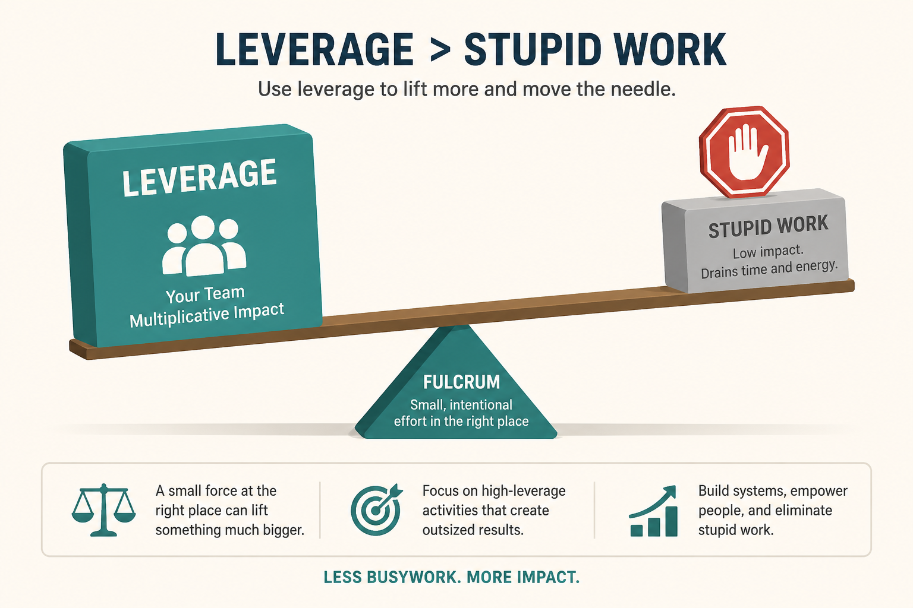

# IC PM → manager of PMs

**Source:** Lenny Rachitsky (@lennysan)
**Post:** https://x.com/lennysan/status/1316029649504202752

## What it claims

The manager job is not “senior IC with reports.” Unexpected jobs: stop stupid work from happening; unblock constantly; hold the PM quality bar; hold the product quality bar; build a united leadership group. How people get promoted: show you can lead people, deliver, handle complexity, develop a winning vision/strategy — and ask. How to succeed: increase the team’s leverage; teach more than do; you do not have to go into management.

## Why it matters for a PO

Many POs are unofficial leads of other POs without the title. The job to maximize is team leverage and quality bars, not more tickets personally specified.

## 3 takeaways

1. Unblocking + stopping bad work is the job.
2. Promotion evidence is people-lead + deliver + complexity + strategy, plus asking.
3. Management is optional; IC excellence is a valid path.

## Practice this week

List the three stupidest in-flight efforts you could stop this week, and one person you will unblock or teach instead of doing the work yourself.
