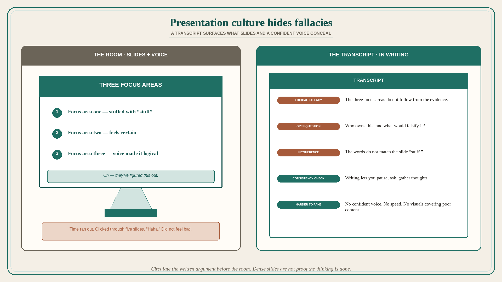

# Presentation culture hides the fallacies writing would surface

**Source:** John Cutler (@johncutlefish)
**Post:** https://x.com/johncutlefish/status/1640059243310243841

## What it claims

Cutler read the transcript of a work presentation, then watched the presentation. The transcript was filled with issues / logical fallacies / open questions. While watching he noticed very few. That is the root issue with presentation culture. Different parts of the brain fire in each context. When slides had lots of “stuff” it felt like “oh they’ve figured this out” even when the words did not match. If you pay attention you can feel this happening. The confident voice of the presenter made the “three focus areas” feel certain, clear, and logical. In writing it felt incoherent. A point for “a compelling visual” — but still interesting. In writing he finds himself asking more questions, checking for consistency, pausing and gathering thoughts. That is very hard during a synchronous presentation. It is way easier to “fake it” in a presentation by talking reasonably confidently and moving pretty quickly. Notice how often time runs out and someone clicks through like five slides. And somehow it does not feel “bad” — “haha time ran out.” It is way harder in writing. Visuals are powerful. They connect more areas of the brain. Which is good and bad: good/bad in that it makes up for poor content; good in that along with great content it can make things very powerful.

## Why it matters for a PO

PI readout culture is this thread: stuffed slides, confident “three focus areas,” time-runs-out click-through, and nobody notices the fallacies a transcript would show. A PO who will circulate the written version before the room — and who will not treat a dense slide as proof the thinking is done — can catch incoherence while it is still cheap.

## 3 takeaways

1. A presentation can hide issues / fallacies / open questions that a transcript makes obvious.
2. Slide “stuff” plus a confident voice make three focus areas feel certain even when the writing is incoherent.
3. Faking it is easy live (speed, time ran out, visuals covering poor content); writing forces questions and consistency.

## Practice this week

Take one upcoming readout. Write the argument as a one-page transcript without slides. Circle fallacies and open questions. Do not present until those are closed — and do not treat leftover “time ran out” slides as decided.
