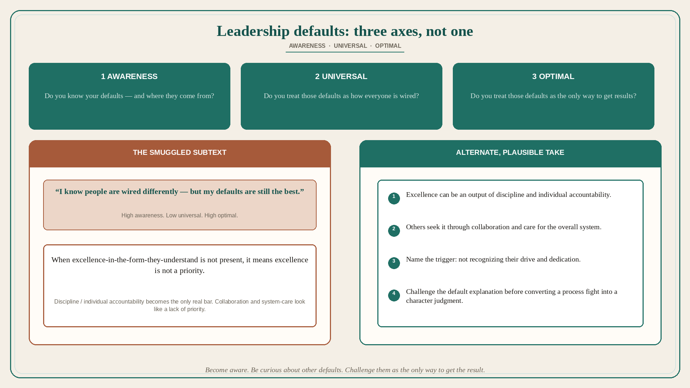

# Leadership defaults: awareness vs “universal” vs “optimal”

**Source:** John Cutler (@johncutlefish)
**Post:** https://x.com/johncutlefish/status/1601991908640706560

## What it claims

How can we all become better leaders? Self-awareness, sure — but we all have default beliefs about work, and varying degrees of (1) awareness of those defaults, (2) conviction that our defaults are universal, (3) conviction that our defaults are optimal. Some people are very self-aware — they have plumbed their motivations — yet also believe their defaults apply to everyone (“everyone is wired like I am wired”). High self-awareness. High conviction their beliefs are universal. Other people accept that their defaults are not universal but believe their defaults are better (“everyone is wired differently, but my defaults are the best”). High self-awareness. Low conviction their beliefs are universal. High conviction their beliefs are optimal. This person senses their own need for “excellence,” can trace it to upbringing, knows they are demanding, and knows they cannot expect other people to respond the way they respond. They show a willingness to adapt their style. BUT the subtext is that excellence is only possible when people care as they care. When excellence-in-the-form-they-understand is not present, it means excellence is not a priority. An alternate take: “I have a strong need to see excellence as an output of discipline and individual accountability. I realize, however, that others seek excellence in other ways including collaboration, and care for the overall ‘system’. I know I’m triggered when I don’t recognize their drive and dedication. I’m making an effort to challenge my default explanation.” Some leaders are very successful despite lacking self-awareness about their defaults. Ultimately all of us can: become aware of our defaults and where they come from; be curious about other people’s defaults; challenge our defaults, looking for alternate, plausible explanations; challenge our defaults as the only way to achieve specific results.

## Why it matters for a PO

Trio “excellence” fights are often this default: I know people are wired differently, but my discipline/accountability is still the only real bar — so collaboration and system-care look like a lack of priority. A PO who will write the alternate take (excellence via collaboration/system, and name the trigger) can stop converting a process disagreement into a character judgment in PI.

## 3 takeaways

1. Three axes, not one: awareness of defaults, conviction they are universal, conviction they are optimal.
2. “I know I’m demanding and people differ” can still smuggle “if they don’t show excellence my way, excellence is not a priority.”
3. Challenge the default explanation: excellence can be discipline/accountability or collaboration and care for the system.

## Practice this week

Write your default about “what good work looks like” in one sentence. Mark whether you treat it as universal, as optimal, or as one way. For one in-flight fight, write an alternate, plausible explanation that uses collaboration/system instead of “they don’t care.” Do not add a personal-accountability story until that alternate is tested.
