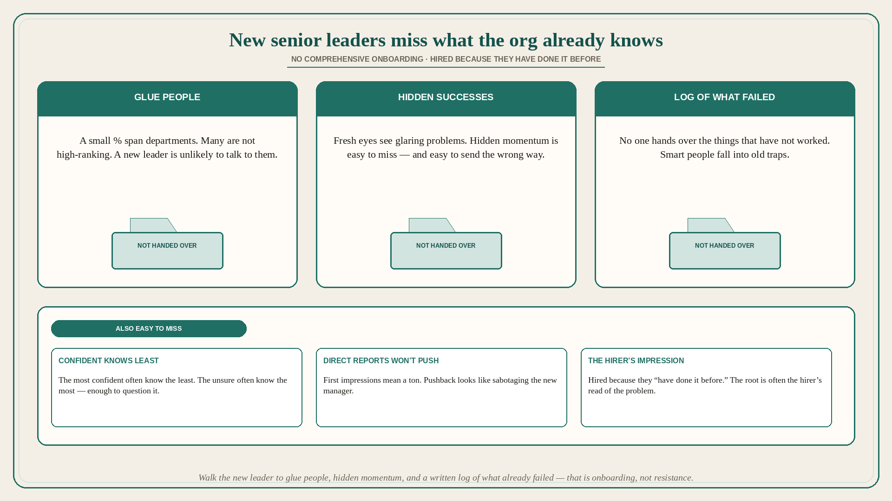

# New senior leaders miss glue people, hidden successes, and the log of what failed

**Source:** John Cutler (@johncutlefish)
**Post:** https://x.com/johncutlefish/status/1571659356663578625

## What it claims

You assume that new senior leaders get a comprehensive onboarding. That often is not the case as they are thrust immediately into the thick of things. Related: it can actually be very difficult to determine who knows what. Often the most confident folks know the least. And the people who seem unsure know the most (but also know enough to question what they know). Knowledge is siloed as it is. A small % of “glue people” have a perspective that spans departments — and many of those glue people are not high-ranking peer leaders. It is highly unlikely that a new leader will talk to those people. Their direct reports are cautious and less likely to push back on something that makes sense. Everyone is aware that first impressions mean a ton. The last thing you want to do is to appear like you are trying to sabotage your new manager. In many cases leaders are hired because they “have done it before.” The root problem is often the person who hired the new leader, and their impression of the problem at hand. When you walk in fresh, it is easy to see all the glaring problems, but hard to see all the hidden successes and momentum. This can easily send you off in the wrong direction. No one hands you a whole log of all the things that have not worked. Or anything approaching the institutional knowledge. It is very easy for a very smart person to completely fall into old traps.

## Why it matters for a PO

A new director who “has done it before” will see the glaring backlog mess, miss the glue people and the hidden momentum, and replay last company’s playbook into a trap the org already tried. Direct reports will not push back — first impressions. A PO who will walk the new leader to the glue people (often not high-ranking), the hidden successes, and a written log of what has not worked is onboarding, not resistance.

## 3 takeaways

1. New senior leaders often get no comprehensive onboarding; they are hired because they “have done it before” — the hirer’s impression of the problem is the root.
2. Confident-knows-least; glue people span departments and are often not high-ranking — a new leader is unlikely to talk to them; direct reports will not push back.
3. Fresh eyes see glaring problems and miss hidden successes/momentum; no one hands over the log of what has not worked, so smart people fall into old traps.

## Practice this week

For the newest senior stakeholder on the product, write: three glue people (not in their skip-level), one hidden success/momentum they have not seen, and one prior bet that already failed. Book those three conversations before the next “I’ve seen this, here’s the playbook” ask.
