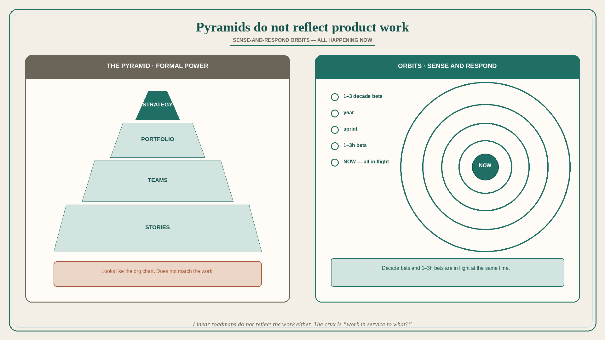

# Pyramids do not reflect product work; use orbits, graphs, and loops

**Source:** John Cutler (@johncutlefish)
**Post:** https://x.com/johncutlefish/status/1571582429835689984

## What it claims

One of the dominant models for organizational goals, work, and structure is the pyramid. Other than vaguely resembling the hierarchical “formal” power dynamic in an organization, pyramids do not really reflect the nature of product work. One way to think of product work is a series of interlocking and related sense-and-respond orbits: it is all happening NOW, but the orbits range in length. Companies are built in 1–3 decade bets; someone comes to work and places a 1–3h bet. Another approach is to visualize a graph of related things that have input/output relationships. The leaves are more “work like”; the branches are more stable/persistent. Time-honored: driver trees, belief maps, OST, capability maps. People create hybrids. There is a clear delineation between “the work” and “the model.” You can plot “work” — but the real crux is “work in service to what?” Another area: visualizing the portfolio relative to opportunity certainty, solution certainty, amenability to experimentation. Wardley Mapping thinks in relatedness and “phase of evolution.” Cutler notes a reframe of the linear roadmap: the “top” of the pyramid is the present, not the c-suite. How might we think about “shape” of bets — a real-world team created a categorization system for work that probably makes little sense to you, but did to them. A lot of these concepts come together in the data-informed product cycle: loops are cliché, but realistically a fractal version of that cycle is what the work actually looks like. This is not a comment on the suitability of a hierarchical org structure, or promoting a network org. Just pointing out that pyramids — and linear roadmaps — do not really reflect the nature of the work.

## Why it matters for a PO

A PI pyramid (strategy at the top, stories at the bottom) looks like the org chart and does not match the work: decade bets and 1–3h bets are in flight now. Linear roadmaps hide “work in service to what?” A PO who will name the orbit length of each in-flight item — and refuse to treat the pyramid as the model of the work — can sequence sense-and-respond instead of cascading a slide.

## 3 takeaways

1. Pyramids resemble formal power; they do not reflect product work. Linear roadmaps do not either.
2. Alternatives: sense-and-respond orbits (decade vs 1–3h, all happening now); graphs / driver trees / belief maps / OST / capability maps; Wardley (relatedness + phase of evolution); portfolio by certainty / amenability to experiment.
3. The crux is “work in service to what?”; a fractal data-informed cycle is closer to the actual work than a hierarchy of goals.

## Practice this week

Take the current roadmap. For each line, write the orbit (decade / year / sprint / 1–3h) and “in service to what?” If everything is a pyramid-level “Q3 theme,” you do not have a model of the work yet — do not add another layer of cascade.
