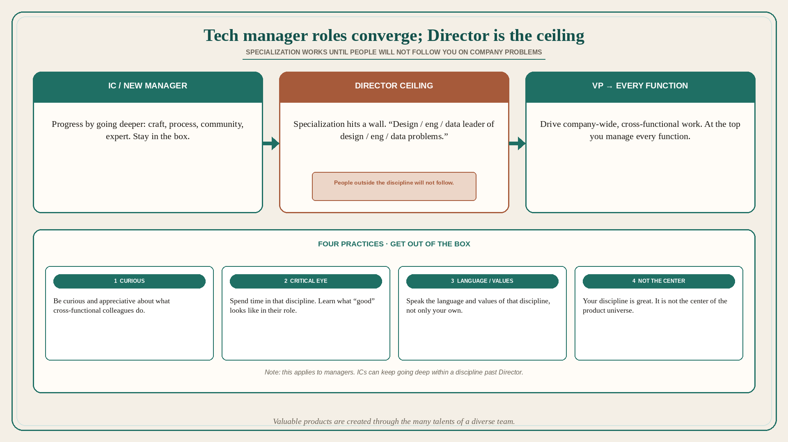

# Tech manager roles converge; Director is the specialization ceiling

**Source:** Julie Zhuo (@joulee)
**Post:** https://x.com/joulee/status/1375116163781292034

## What it claims

Zhuo has participated in too many conversations about the role of design / PM / eng to count. Of course there are differences. But every tech manager role, regardless of discipline, ends up converging at higher levels. If you climb the management ladder to the very top, you are the CEO, and you manage every function. So if the goal is to be CEO someday, or even VP or director within your discipline, you need to get out of your box and learn how other disciplines work. The most thoughtful designs do not get used if engineering does not build them. The most sophisticated algorithms do not help people if they cannot be put into a clear product. The tightest roadmap does not get you customers if the experience is not good, or you cannot sell it. “Learn other disciplines” is counterintuitive because for the 1st phase of your career, as an IC / new manager, you progress by going deeper — craft, process, community, expert. But around Director, you hit a ceiling with specialization. If people think of you as only a “design leader,” “eng leader,” or “data leader” who only works on “design,” “eng,” or “data” problems, rather than company or product problems, it will be hard for them to follow you if they do not consider themselves part of your discipline. At the VP level in particular, managers should demonstrate an ability to successfully drive company-wide, cross-functional initiatives. How to expand: (1) be curious and appreciative about what your cross-functional colleagues do; (2) spend time with folks in that discipline to develop your critical eye for what it means to be good within that role; (3) learn to speak the language and values of that discipline; (4) remind yourself that your discipline is great, but it is not the center of the product universe. Valuable products are created through the many talents of a diverse team. The above applies to managers only. ICs can very successfully go deep and continue to grow their careers within their discipline beyond the director level.

## Why it matters for a PO

A PO who stays “the backlog person” past the Director ceiling will not be followed by eng or design on company problems — they look like a discipline lead protecting a function. The four practices are trio hygiene: curiosity, a critical eye for their good, their language/values, and not making PO the center. Distinct from IC growth: ICs can keep going deep.

## 3 takeaways

1. Tech manager roles converge at higher levels; around Director, specialization hits a ceiling.
2. If you are only the design/eng/data leader of design/eng/data problems, people outside the discipline will not follow you on company/product problems.
3. Four practices: curious/appreciative, critical eye for what “good” is in the other role, speak their language and values, your discipline is not the center. ICs can keep going deep.

## Practice this week

Pick the function you least understand (eng, design, sales). Spend one working block with them. Write what “good” looks like in their terms. Rewrite one story using that language. Do not add a PO-centric acceptance criterion that ignores it.
