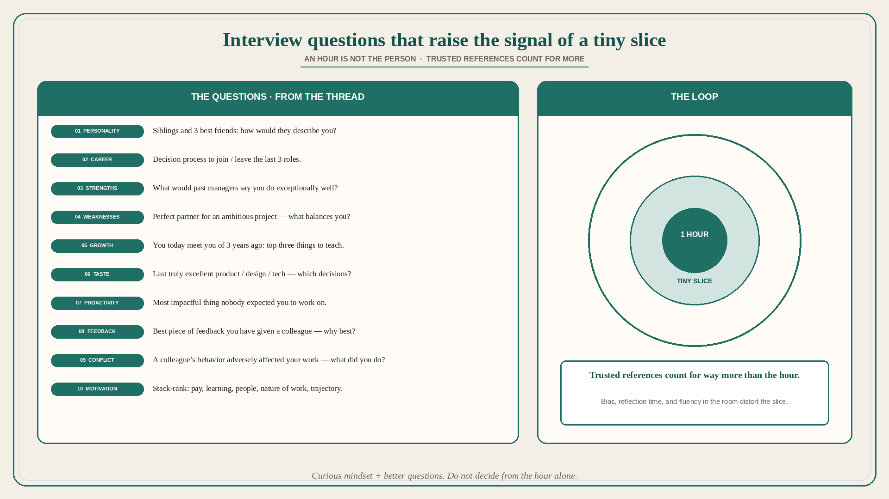

# Interview questions that raise the signal of a tiny slice

**Source:** Julie Zhuo (@joulee)
**Post:** https://x.com/joulee/status/1392504865352417284

## What it claims

Zhuo geeks out on how to get to know someone better, and on interview questions that show how people think and work. Personality: if I interviewed your siblings and 3 best friends and asked them to describe you, what would they tell me? Career journey: what was your decision-making process to join/leave your last 3 roles? Strengths: if I asked your past managers and colleagues to tell me what you do exceptionally well compared to others, what would they say? Weaknesses: imagine you could work with the perfect partner to start an ambitious project — what kind of person would you look for to complement you; what skills would they have that would balance you? Growth: imagine the you of today met the you of 3 years ago — top three things you have learned that you would teach the past you; how did you come to learn those things? Taste: when was the last time you experienced a product/design/technology that you felt was truly excellent; why; what specific decisions do you admire from its creators? Proactivity: tell me about the most impactful thing you did to address a problem you saw that nobody expected you to work on; what happened? Feedback: what was the best piece of feedback you have ever given to a colleague; why do you consider it the best? Conflict: describe a time when you or your work was adversely affected by the behavior of a colleague; situation; what did you do? Motivation: stack-rank compensation, learning, people and work environment, nature of the work, career trajectory, something else — what matters most to you right now in considering a role. An hour with someone is a tiny slice. Trusted references count for way more than an interview. Biases, time spent on reflection, communication skills all sway our understanding. Still, we can make the time we do have higher-signal with a curious mindset and a better set of questions.

## Why it matters for a PO

Trio hiring often runs “tell me about a time you prioritized” and a take-home. Zhuo’s set is a map: personality via others, join/leave logic, strengths via colleagues, weakness via the complementary partner, growth via teaching the past self, taste via a specific excellent product, unassigned problem, feedback given (not received), conflict when their work was hit, motivation as a stack-rank. References still beat the hour. A PO on a hiring loop who will use these — and not treat the hour as the decision — raises signal without pretending the slice is the person.

## 3 takeaways

1. Named questions for personality, career, strengths, complementary-partner weaknesses, growth, taste, unassigned impact, feedback given, conflict, motivation stack-rank.
2. An hour is a tiny slice; trusted references count for way more; bias, reflection time, and communication skill distort the hour.
3. Raise the signal with a curious mindset and better questions; do not confuse fluency in the room with the person.

## Practice this week

For the next hiring loop, replace one generic “tell me about a time” with Zhuo’s complementary-partner weakness question and the unassigned-problem question. Write whose references you will actually call. Do not decide from the hour alone.
