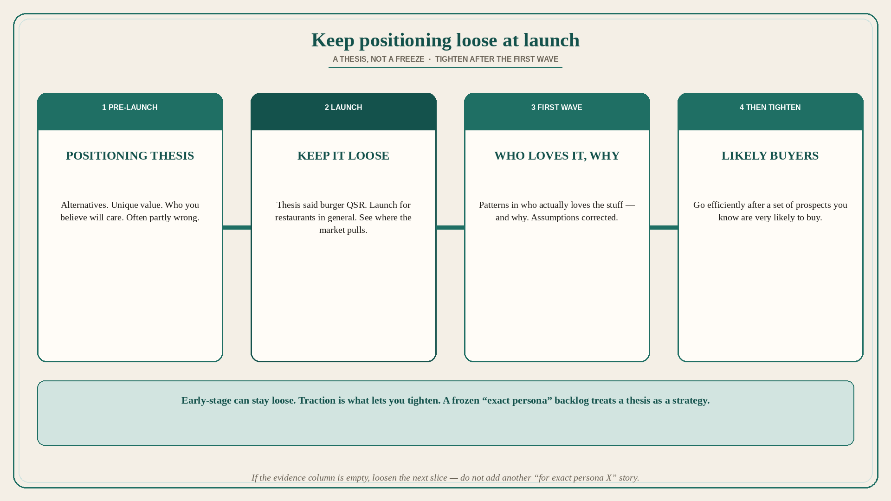

# Keep positioning loose at launch; tighten after the first wave

**Source:** April Dunford (@aprildunford)
**Post:** https://x.com/aprildunford/status/1525107765546450946

## What it claims

Positioning changes with the maturity of the company. Early-stage startups can keep their positioning fairly loose; the more traction you have, the more you can tighten it up. Before you launch, ideally you have done customer discovery and have a “Positioning thesis.” The thesis outlines the alternatives to your solution, the value that only you can deliver, and what customers you believe will care a lot about that value. But it is just a thesis. In Dunford’s experience, the thesis is often partly correct and partly wrong. The first wave of customers teaches you where your assumptions were correct and where they were not. Your positioning will shift once you understand this. It is good to keep the positioning of a newly launched product pretty loose. Your thesis might be that your product is perfect for quick-serve burger restaurants, but you might want to launch it for restaurants in general and see where the market pulls you. Once you have a wave of customers through the door you will start to see patterns in who loves your stuff and why. You can then tighten up your positioning to efficiently go after a set of prospects you know are very likely to buy.

## Why it matters for a PO

A pre-launch “we are for this exact persona” that then freezes the backlog is treating a thesis as a strategy. Distinct from already-used five-components-in-order and category-vs-value: here the move is looseness at launch, then tighten on who actually loves it. A PO who will launch a wider net than the thesis (restaurants, not only burger QSR) and refuse to sequence the tight segment until the first wave has spoken is not “unfocused” — they are still in thesis.

## 3 takeaways

1. Pre-launch work is a positioning thesis: alternatives, unique value, who you believe will care — often partly wrong.
2. Keep newly launched positioning loose; let the first wave show where the thesis was correct.
3. Tighten only after patterns in who loves it and why; then go efficiently after likely buyers.

## Practice this week

Write the current positioning in two columns: thesis (what we believed at launch) vs first-wave evidence (who actually loves it and why). If the backlog is already sequenced to the thesis persona and the evidence column is empty, loosen the next slice — do not add another “for exact persona X” story.
