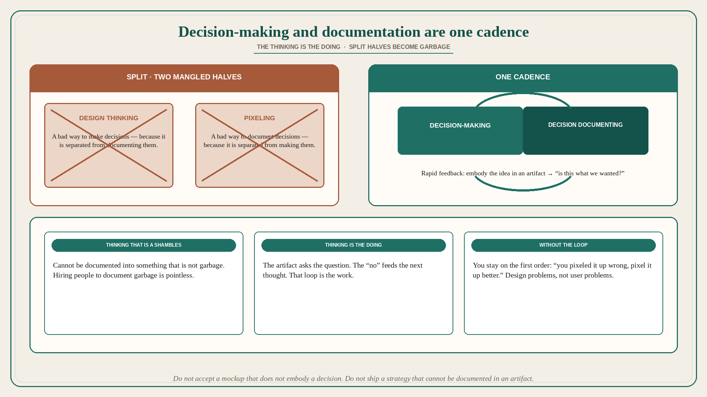

# Decision-making and documentation are one cadence, not two jobs

**Source:** Pavel A. Samsonov (@PavelASamsonov)
**Post:** https://x.com/PavelASamsonov/status/1594051373208936450

## What it claims

It is difficult to reconcile that the same people who say they practice “design thinking” will tell you that design is when you draw pictures. Both approaches are just a mangled implementation of one half of a holistic design cadence: decision-making 🔁 decision documenting. Design thinking is a bad way to make decisions, and design pixeling is a bad way to document them, because they are separated from one another. When you say “it is our job to think” and then make a shambles of the thinking, it is not possible for someone else to document the results in a way that does not reveal it to be the garbage that it is. To even try is pointless — and yet orgs hire designers to do exclusively this. Part of what makes design so effective is the rapid feedback cycle between thinking and doing: by embodying the idea in an artifact we quickly ask “is this what we wanted?” and if the answer is “no” we incorporate that into our thinking to improve it. The thinking IS the doing. A stable decision 🔁 documentation feedback loop also supports higher-order loops. Without that loop, you will always be stuck on the first order — “you pixeled it up wrong, pixel it up better.” Design gets stuck solving design problems, not user problems.

## Why it matters for a PO

A sprint that hands “the thinking” to the PO and “the pixels” to design is this split: design thinking without a documentable decision, and pixeling of garbage. Distinct from keeper 175 (methods out of order) and from already-used “a design is documentation of decisions”: here the claim is the loop — thinking is doing; without it you only ever get “pixel it up better.” A PO who will not accept a mockup that does not embody a decision — and will not ship a “strategy” that cannot be documented in an artifact — keeps the cadence.

## 3 takeaways

1. Design thinking and pixeling are each a mangled half; the cadence is decision-making 🔁 decision documenting.
2. Thinking that is a shambles cannot be documented into something that is not garbage; hiring people to document garbage is pointless.
3. Thinking IS the doing (artifact → “is this what we wanted?”). Without that loop you stay on “pixel it up better” and solve design problems, not user problems.

## Practice this week

For one in-flight mockup, write the decision it documents in one sentence. If you cannot, stop pixeling. For one “strategy” doc, name the artifact that would show “is this what we wanted?” If there is none, the thinking is not doing yet.
