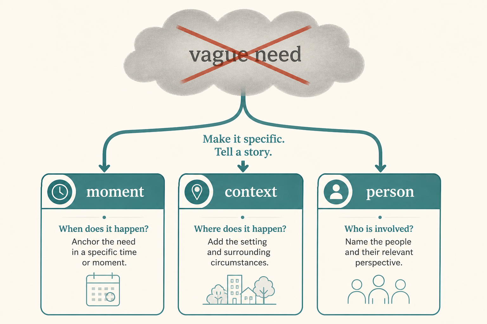

# Opportunity mapping fails until opportunities are specific and story-sourced

**Source:** Teresa Torres (@ttorres)
**Post:** https://x.com/ttorres/status/1615148155883978758

## What it claims

Teams abandon opportunity solution trees because they invent vague opportunities (“I can’t find something to watch”) instead of collecting specific, contextual ones from past-behavior stories. A usable opportunity happens at a moment, in a context, for a person. Story-based interviewing is the input; the tree is the map.

## Why it matters for a PO

A backlog of “make discovery better” is untestable. Specific opportunities open a real solution space and stop garbage-in trees.

## 3 takeaways

1. Don’t brainstorm needs from inside the building.
2. Frame opportunities as specific moment + context + customer.
3. Interview for last-time stories, then excavate detail until opportunities fall out.

## Practice this week

This week, take one vague opportunity on the tree, interview 3 users about the last time it happened, and rewrite it as a one-sentence specific opportunity.
