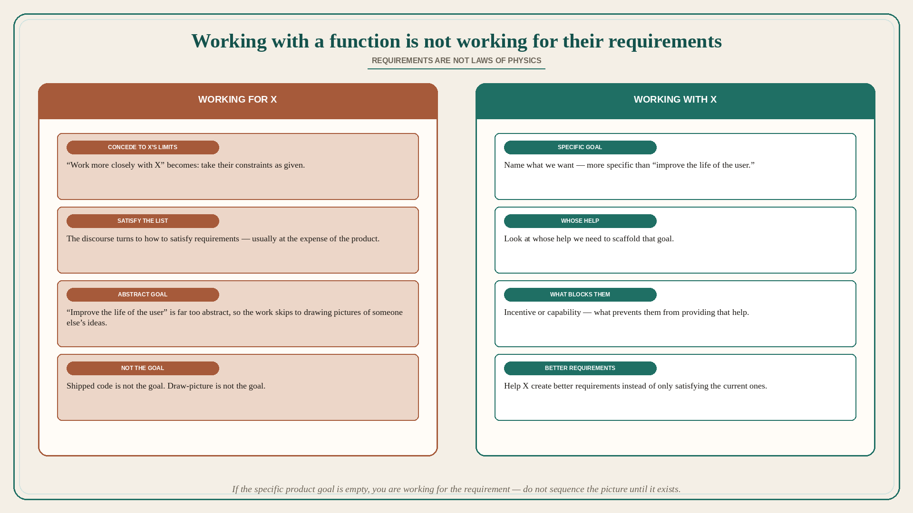

# Working with a function is not working for their requirements

**Source:** Pavel A. Samsonov (@PavelASamsonov)
**Post:** https://x.com/PavelASamsonov/status/1609678804183572481

## What it claims

Why is it that “design should work more closely with X function” narratives are always about conceding to X’s limits rather than improving X’s ability to support design? Product, eng, sales, etc. “requirements” are not laws of physics. And yet rather than help these people create better “requirements,” the discourse always turns back to how to satisfy them (usually at the detriment of design’s own incentives). Samsonov suspects this is because design as a practice has a very limited conception of what it wants. “Improve the life of the user” is far too abstract. Rather than think about how to scaffold that work, designers skip to drawing pictures of someone else’s ideas. Designers who are able to articulate a more specific goal than “improve the life of the user” can start to build that scaffold, by looking at whose help they need and what is preventing them from providing that help (incentives or capabilities). “Design should work with X function” should only ever be asked within this context — what does design want? Because giving up on those goals is not working with someone, but working for them. “Shipped code” is not the goal. “Draw picture” is not the goal.

## Why it matters for a PO

“The PO should work more closely with sales / eng / architecture” often arrives as: take their requirements, sequence them, draw the picture, ship the code. Samsonov’s test: requirements are not physics; if we cannot name a specific goal (not “improve the user”), we will only satisfy X at the expense of the product. A PO who will name what we want, then ask whose help we need and what incentive/capability is blocking them, is working with. Taking the intake list is working for.

## 3 takeaways

1. “Work more closely with X” that only concedes to X’s limits is working for X, not with X.
2. Product/eng/sales requirements are not laws of physics; help them create better ones instead of only satisfying them.
3. A specific goal (not “improve the life of the user”) lets you scaffold whose help you need and what incentive/capability is in the way. Shipped code and draw-picture are not the goal.

## Practice this week

Take one “sales asked / architecture required” item. Write (a) the specific product goal, (b) whose help you need, (c) the incentive or capability blocking them. If (a) is empty, you are working for the requirement — do not sequence the picture until (a) exists.
