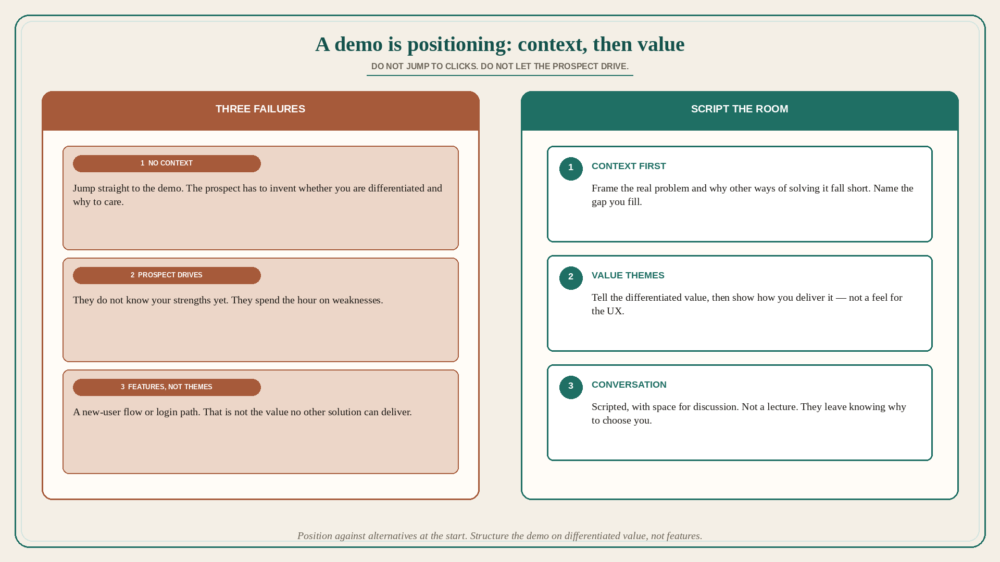

# A demo is positioning: context vs alternatives, then value themes

**Source:** April Dunford (@aprildunford)
**Post:** https://x.com/aprildunford/status/1374431598674812943

## What it claims

A good demo call does a lot more than demo the product — it is the chance to position the product, the startup, and all the alternatives in the market. Startups generally stink at this. Problem 1: most jump straight to the demo with no context setting. First frame the conversation around your view of the real problem customers are facing and why other ways of solving it fall short. Done right, that calls attention to the gap the product fills and why that matters for the customers you sell to. If you do not set that up before the demo, you leave it to the customer to figure out whether your features are differentiated and why they should care. Problem 2: letting the customer drive the demo. Prospects do not know your stuff yet. If they dictate what you show, you easily spend too much time on weaknesses and not enough on strengths. The best demo calls are scripted but leave plenty of space for discussion — conversation, not lecture. Customers should get what they need; you need them to leave with a clear understanding of differentiated value. Problem 3: the demo is structured around features, not value themes. Startup demos are often structured around what a new user would do, or around a specific user flow. That does not always show the value no other solution can deliver. Better: tell the customer what the key differentiated value is, then show how you deliver it — not just a feel for the UX, but why to choose you over alternatives. Close: position yourself against the alternatives at the start; do not let the customer drive what you show (while keeping it a conversation); structure the demo around differentiated value, not features.

## Why it matters for a PO

A PO who “just walks the sprint increment” is running problem 1+3: no alternative-context, a new-user feature flow. Distinct from already-used walkthrough 156064 (five moves including proof and next-step): here the operational failures are no context, prospect drives, features not themes. A PO who will script the first five minutes as “problem / why other approaches fall short / the gap we fill,” then demo value themes instead of the login path, is positioning in the room — not handing the click-path to the loudest stakeholder.

## 3 takeaways

1. Context before clicks: frame the real problem and why other ways fall short, or the prospect has to invent your differentiation.
2. Do not let the prospect drive the demo; they do not know your strengths yet. Scripted + conversation, not lecture.
3. Organize on differentiated value themes, then show delivery — not a new-user feature flow.

## Practice this week

Before the next stakeholder or customer demo, write three lines: (a) the problem, (b) why two alternatives fall short, (c) the value theme you will show first. Cut the new-user / login path. Do not let the first question from the room rewrite the script into a weakness tour.
