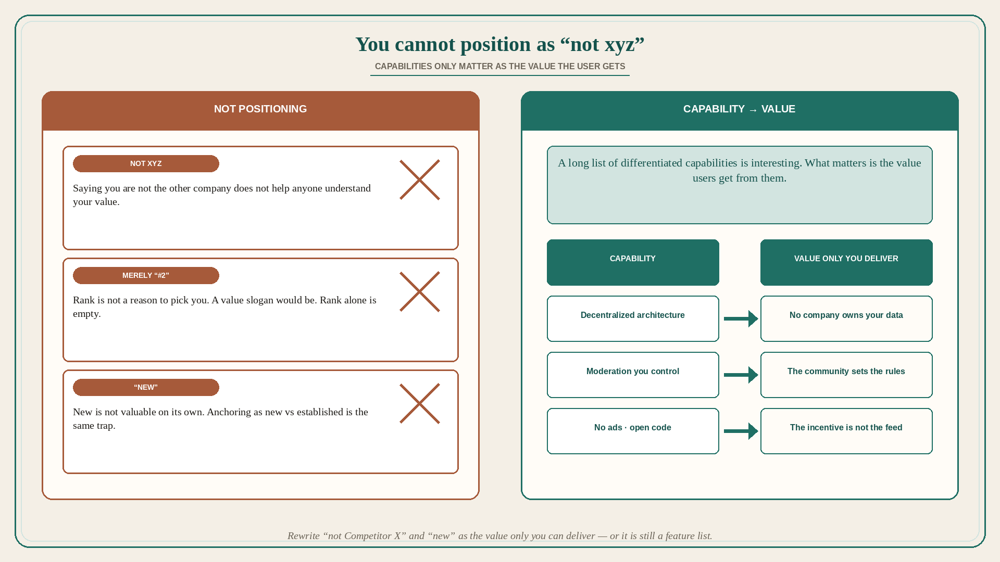

# You cannot position as “not xyz”; capabilities only matter as value

**Source:** April Dunford (@aprildunford)
**Post:** https://x.com/aprildunford/status/1590001011342839808

## What it claims

Dunford uses Mastodon vs Twitter as a case study on how you cannot really position a product purely by saying it is “not xyz,” where xyz is another company. She does not believe Mastodon positions itself as “not Twitter,” but many people think about it that way because they do not understand it yet. The problem with that type of positioning: it does not help anyone understand the value of the other offering. Ries & Trout’s Avis story: Avis deliberately positioned around #2 status vs Hertz; the slogan “We try harder” communicated value — the leader was complacent, the scrappy underdog would give better service. Saying you are #2 is not a reason to pick you. Saying you try harder is. Same trap as companies that anchor positioning by saying they are “New” vs established competitors. What is the value of new? New is not valuable on its own. Mastodon has a long list of clearly differentiated capabilities — federated servers, content moderation, non-profit status, no ads, open-source code. Those are interesting; what matters is the value users get from those capabilities. The positioning opportunity is to communicate the value only they can deliver. Example: users should understand the value of decentralization (no company owns your data) vs seeing it as simply something different from Twitter and kind of a pain. Dunford has zero opinion on whether Mastodon is a valid Twitter alternative for most people and is watching the positioning play out. This is a value-from-capability lesson, not a Mastodon promo.

## Why it matters for a PO

Backlog copy that is “not SAP / not the legacy tool / the new module” is Avis-without-the-slogan: #2, or “new,” with no value. A capability list (API, SSO, audit log, OSS) is Mastodon’s federated-servers list until it is translated into buyer value. A PO who will refuse a “not Competitor X” epic title — and will rewrite each capability as the value only we can deliver — is positioning, not competing on the rival’s name.

## 3 takeaways

1. “Not xyz” (and merely “#2” or “new”) does not communicate value; Avis worked because “We try harder” did.
2. Differentiated capabilities are not positioning until they are the value the user gets from them.
3. Example pattern: decentralization → no company owns your data — not “unlike Twitter, and kind of a pain.”

## Practice this week

Take one in-flight item titled against a rival or as “new.” Rewrite it as value (what only we deliver). For each capability on the story, add one sentence of user value. If you cannot, it is still a feature list — do not sequence it as positioning.
