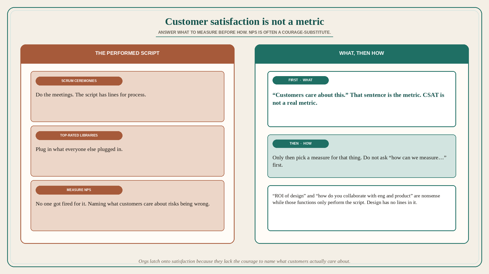

# Customer satisfaction is not a metric; NPS is a courage-substitute

**Source:** Pavel A. Samsonov (@PavelASamsonov)
**Post:** https://x.com/PavelASamsonov/status/1569027366990528513

## What it claims

The question is asked in good faith but from the wrong direction. “Customer satisfaction” is not a real metric. Designers must understand what satisfies their customers, and then measure that. Do not ask “how can we measure…” before you have answered “what should we measure.” Orgs latch onto “customer satisfaction” because they lack the courage to say “customers care about this” and expose themselves to the risk of being wrong — or even the intellectual hassle of developing their own metrics. No one got fired for measuring NPS. So enormous tech salaries are paid not for problem solving, but for performing a script: do the Scrum ceremonies; plug in the top-rated React libraries; measure change in NPS. The reason “what is the ROI of design” is asked so often by people performing this script is that design has no lines in it — it only disrupts the performers by reminding them that the outside world still exists. Design is incompatible with performing the script. “What is the ROI?” is a nonsense question. “How do you collaborate with eng and product?” is a nonsense question when eng and product are organized solely around performing the script.

## Why it matters for a PO

A PI dashboard with CSAT/NPS as the outcome, Scrum as the process, and a framework checklist as engineering is this script. Distinct from already-used Cutler wean-off-NPS (lesson 153: NPS is lagging, name the levers): here the claim is prior — CSAT is not a metric at all; NPS is what you measure when you will not risk naming what customers actually care about. A PO who will write “customers care about X” (and accept being wrong) before picking a survey is not “anti-NPS”; they are answering what to measure. Asking design for ROI while the org only performs the script is nonsense.

## 3 takeaways

1. “Customer satisfaction” is not a real metric; answer what should be measured before how.
2. NPS is often a courage-substitute: no one got fired for it; naming “customers care about this” risks being wrong.
3. Scrum + top-rated libraries + NPS is a performed script; ROI-of-design and “how do you collaborate” are nonsense while eng/product only perform it.

## Practice this week

If CSAT/NPS is on the train dashboard, write one sentence: “Customers care about ____.” If you cannot, do not add another survey story. Name the thing; pick a measure for that. Do not ask design for ROI of a ceremony script.
