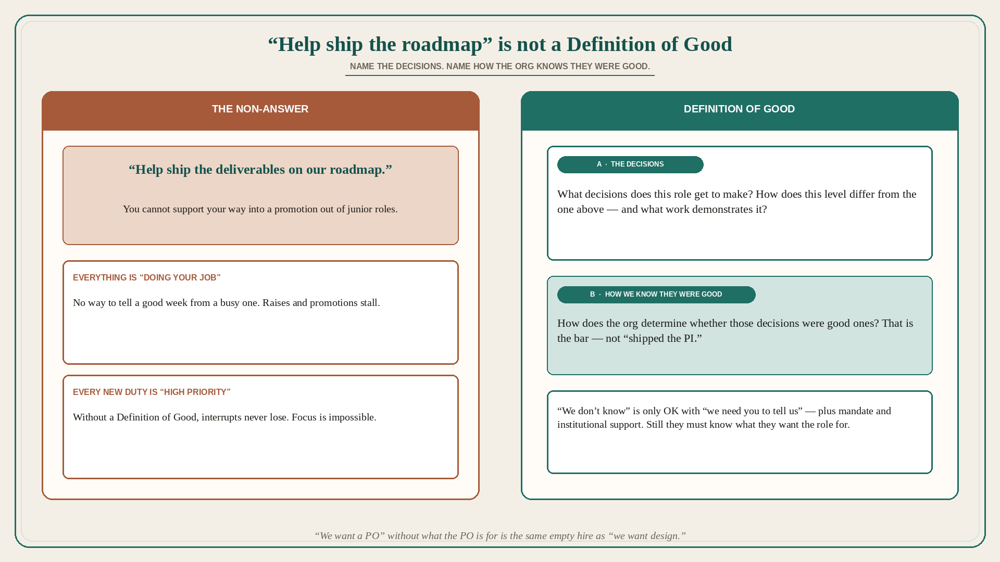

# “Help ship the roadmap” is not a Definition of Good

**Source:** Pavel A. Samsonov (@PavelASamsonov)
**Post:** https://x.com/PavelASamsonov/status/1569370133562331144

## What it claims

Fun question to ask hiring managers: how do requirements differ between this role’s level and the role one level above it, and what work does this role get to do that demonstrates those requirements? If they cannot answer to your satisfaction, the role lacks a Definition of Good. Without a satisfying Definition of Good, good luck getting raises or promotions. Everything you do will be “doing your job” — and worse, every new responsibility added to the role will be “high priority.” Only a Definition of Good lets you focus on the high-impact work. Frequently, answers sound like “help ship the deliverables on our roadmap.” That is not a good answer — you cannot support your way into a promotion out of junior roles. What decisions does this role get to make, and how does the org determine whether they were good ones? This lapse is forgivable if — and only if — the role will have the org mandate to establish the Definition of Good, and explicit institutional support standing behind that definition once it is created. “We don’t know” should be followed by “we need you to tell us.” In that case the hiring manager should still have a very clear idea of why they are hiring this role and what its impact needs to be in terms the business already cares about. Don’t tell me “we want design” without an understanding of what you want design for.

## Why it matters for a PO

“The PO helps the team ship the PI roadmap” is exactly the non-answer. Every interrupt is then “high priority,” and every week is “doing your job,” with no promotion path and no way to tell a good decision from a busy one. A PO who will name the decisions this role makes (what we will not build, which slice, which user) — and how the org will know they were good — has a Definition of Good. “We want a PO” without what the PO is for is the same empty hire as “we want design.”

## 3 takeaways

1. If the hiring manager cannot say how this level differs from the one above, and what work demonstrates it, there is no Definition of Good.
2. “Help ship the roadmap” is not an answer; you cannot support your way out of junior. Name the decisions and how the org knows they were good.
3. “We don’t know” is only OK with “we need you to tell us” plus mandate and institutional support — and still they must know what they want the role for.

## Practice this week

Write the Definition of Good for this PO role in two lines: (a) decisions you make, (b) how the org would know they were good. If (a) is “help ship the roadmap,” you do not have one yet — do not add another “high priority” intake until (a) exists. Ask the same two questions of the next role you are asked to hire.
