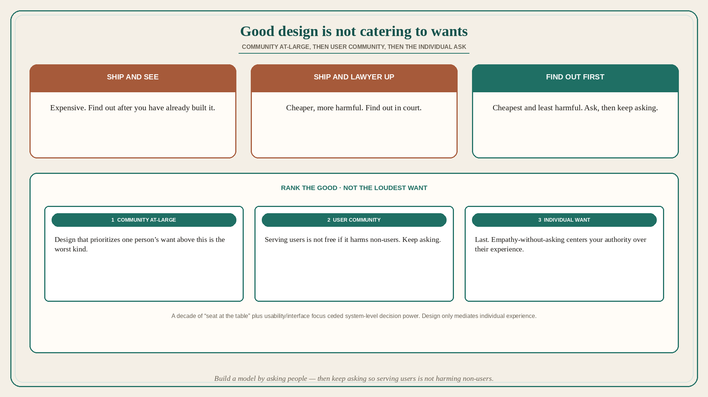

# Good design is not catering to wants; three ways to build

**Source:** Pavel A. Samsonov (@PavelASamsonov)
**Post:** https://x.com/PavelASamsonov/status/1597318295916380160

## What it claims

Good design is not “user centered” in the sense of catering to individual user needs, and certainly not user wants. Design decisions that prioritize those above the good of the community at-large, and then the user community, are the worst kind of design. It is not enough to “build empathy” for those affected by your decisions — that centers your authority over the community’s experience. Build a model of what people want by asking them, and then keep asking them to make sure serving your users is not harming non-users. There are three ways to build products: fuck around and find out (expensive); fuck around and lawyer up (cheaper but more evil); find out before you fuck around (cheapest and least harmful). Design’s three-decade focus on “getting a seat at the table” squandered its power to do things the third way by ceding decision-making power over the system. The emphasis on “usability” and the interface layer ensures that design practice only ever mediates individual experience.

## Why it matters for a PO

A sprint that sequences the loudest user’s want, calls it “user centered,” and treats usability polish as the design job is this failure. Distinct from keeper 181 (feeling devalued / seat as the wrong scoreboard): here the seat-at-the-table campaign gave away system decisions so design only mediates the interface. A PO who will rank community-at-large, then user community, then individual want — and will ask whether serving this user harms non-users — is finding out before shipping, not catering.

## 3 takeaways

1. Good design does not cater to individual needs/wants above the community at-large, then the user community.
2. Empathy-without-asking centers your authority; keep asking so serving users is not harming non-users.
3. Three ways to build: find out first (cheapest/least harmful) vs ship-and-see vs ship-and-lawyer-up. Seat-at-the-table + usability/interface focus ceded system-level power.

## Practice this week

For one in-flight “user asked” story, write who is not the user and whether serving the ask harms them. If the only design on it is interface/usability, you have already ceded the system decision — do not add a want-from-one-person slice until the non-user cost is named.
