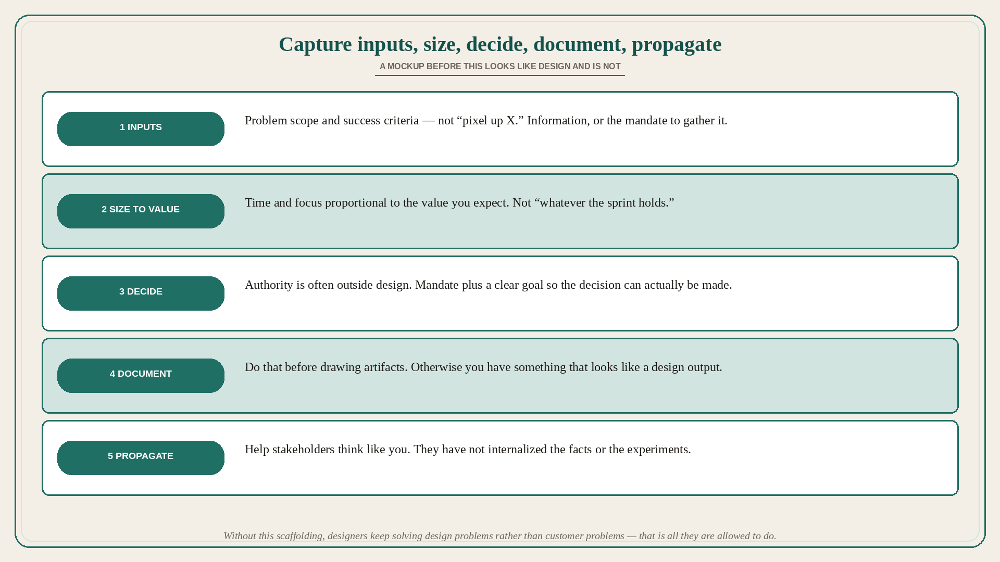

# Capture inputs, size effort to value, decide, document, propagate

**Source:** Pavel A. Samsonov (@PavelASamsonov)
**Post:** https://x.com/PavelASamsonov/status/1571558976550051847

## What it claims

On design tools, the wish is one that captures the full design process: finding and closing gaps in inputs; sizing effort to the required outputs; making the design decisions; documenting the decisions; propagating the mental model behind the decisions. Inputs are simple but usually glossed over in low-maturity orgs: do we have a clear problem scope and success criteria, not just “pixel up X”? Do we have all the information we need, or barring that, the mandate to gather it? Sizing outputs: companies without a design culture struggle here. Investment into a design effort (not just money but time, focus) should be proportional to the value you expect from the effort. Very often the authority to make design decisions lies outside the design team — which is why getting inputs right includes the mandate to do what you need, and a clear goal to guide those decisions. Doing all of that before drawing artifacts — documenting the decisions you made — is critical. Otherwise you have something that looks like a design output, but is not. And if you did all that and have great designs, the work does not end: stakeholders and cross-functional colleagues have not internalized the facts you learned or the experiments you ran. The work is to help them think like you. Can one tool do it all? Unknown. Without a scaffolding for a process that looks something like this, designers will continue to focus on solving design problems rather than customer problems, because that is all they are allowed to do.

## Why it matters for a PO

A sprint that starts at the mockup is skipping inputs and sizing, then shipping a picture that looks like design. Distinct from keeper 175 (methods out of order) and keeper 189 (thinking 🔁 documenting as one cadence): here the PO-usable list is five moves — inputs, size-to-value, decide, document, propagate the mental model. A PO who will not accept “pixel up X,” who will size the design week to expected value, and who will spend a working block helping the trio think the decision (not only review the Figma) is running the scaffolding. Without it, design is only allowed to solve design problems.

## 3 takeaways

1. Scaffolding: close input gaps → size effort to expected value → make decisions → document them → propagate the mental model.
2. Inputs: problem scope and success criteria, not “pixel up X”; information or the mandate to gather it; mandate and a clear goal, because decision authority is often outside design.
3. Artifacts before that look like design and are not. After the artifact, the work is helping others think like you — or design stays on design problems.

## Practice this week

For one in-flight mockup, fill the five lines (inputs / size-to-value / decision / document / who has the mental model). If inputs are “pixel up X” or sizing is “whatever the sprint holds,” stop drawing. Do not add a review meeting that only comments on pixels.
