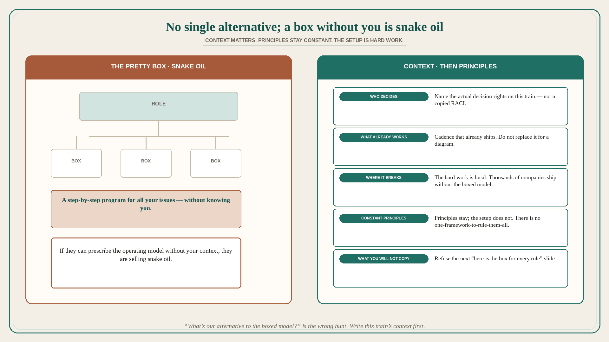

# There is no single alternative to SAFe; a box diagram without context is snake oil

**Source:** Melissa Perri (@lissijean)
**Post:** https://x.com/lissijean/status/1583866770405801984

## What it claims

It is funny how many people ask what the alternative to SAFe is, as if there were not thousands of successful companies building products without it. Those who ask do not want to hear the truth: context matters for what you implement for each company. There is no “one framework to rule them all.” It is incredibly hard work to set this up in companies, but there are principles which remain constant. That was the point of Cagan’s talk and of Escaping the Build Trap. So no, she cannot give a pretty little diagram where everyone has a box and it defines specifically what to do — she honestly wishes she could. It would be easier to offer a step-by-step program for all your issues without knowing you. She cannot, and no one else can either until they understand your context. If they are telling you otherwise, they are selling snake oil.

## Why it matters for a PO

“What’s our alternative to SAFe?” as a hunt for the next boxed operating model is the question being mocked. Thousands of companies ship without it; the work is context plus constant principles, not a replacement diagram. A PO who will refuse the next “here is the box for every role” slide — and will instead name this train’s context (who decides, what the principles are, what is actually hard) — is not being difficult. The vendor who can prescribe the program without knowing you is selling snake oil.

## 3 takeaways

1. There is no single alternative to SAFe; thousands of companies build products without it.
2. Context matters; there is no one-framework-to-rule-them-all. Principles stay constant; the setup is hard work.
3. A pretty box diagram that defines what everyone should do without knowing you is snake oil.

## Practice this week

If someone asks “what’s our SAFe alternative,” write this train’s context in five lines (who decides, cadence that already works, where it breaks, which principle is non-negotiable, what you will not copy from a diagram). Do not add a replacement-framework evaluation until those five exist.
